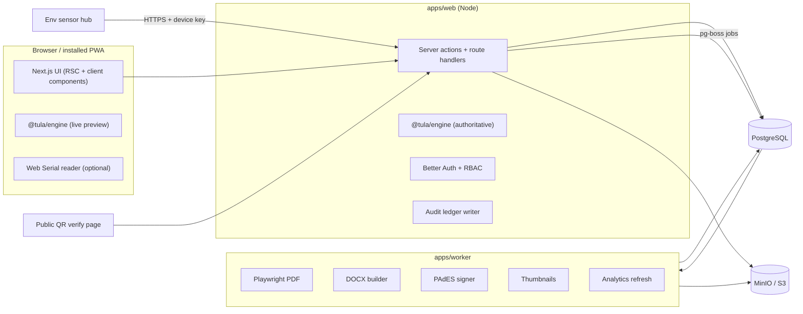
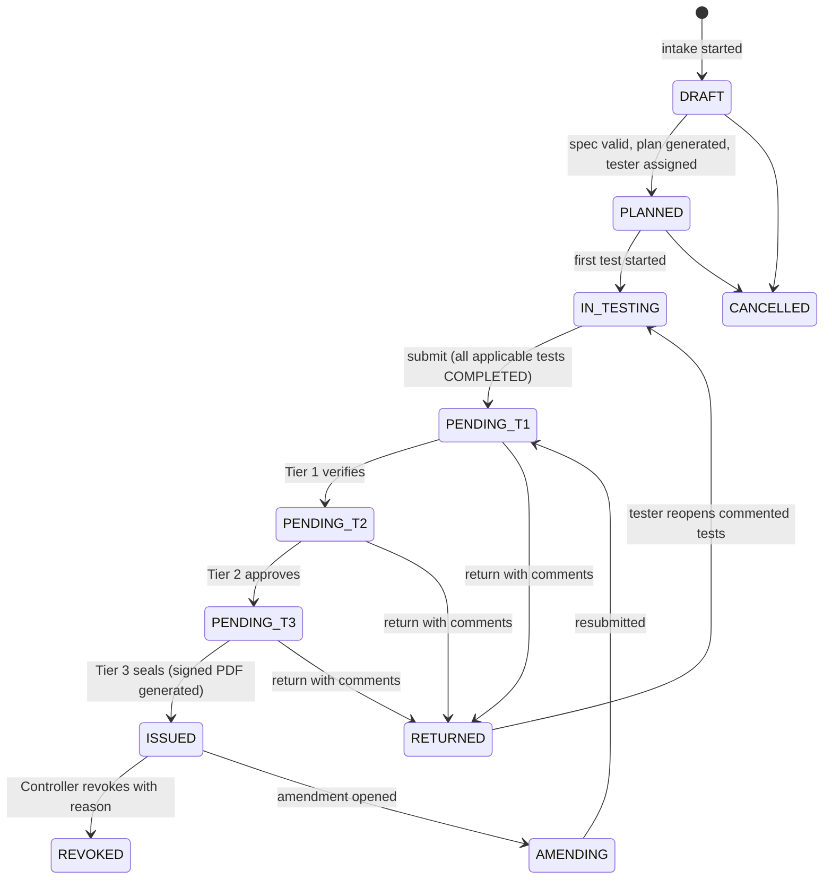
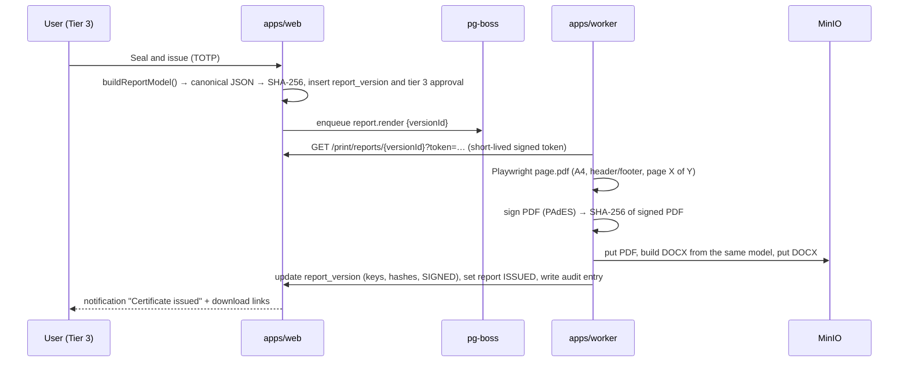

# Tula — OIML R 76 NAWI Type-Evaluation & Test Report System
## implementation.md — phase-wise build orchestration

> **Problem statement:** SIH PS 26035, Department of Consumer Affairs (Legal Metrology), Ministry of Consumer Affairs, Food & Public Distribution.
> **Build mode:** one phase per coding-agent session, VS Code + CLI agent.
> **This file is the source of truth.** If code and this file disagree, fix one of them in the same commit and log the decision in `docs/PROGRESS.md`.
> **Product name:** Tula (तुला, "balance"). Package scope `@tula/*`. Rename if you like, but do it once, globally.

---

## Table of contents

0. How to use this file
1. Product scope and requirement traceability
2. Tech stack (decided)
3. Architecture and repository layout
4. OIML R 76 calculation engine specification
5. Data model
6. Roles, permissions and workflow
7. UI/UX specification
8. Report specification (PDF, DOCX, signatures, QR verification)
9. Security, audit and compliance
10. Build phases P0–P12 (with kickoff prompts)
11. Agent operating rules (copy into CLAUDE.md / AGENTS.md)
12. Testing strategy and quality gates
13. Seed data and demo script
14. Risks and mitigations
15. Project definition of done
Appendix A: `docs/PROGRESS.md` template · Appendix B: Glossary

---

## 0. How to use this file

**You (human):**
1. Create an empty git repo and put this file at the root.
2. Copy §11 into your agent's rules file (`CLAUDE.md`, `AGENTS.md`, `GEMINI.md` — whichever your CLI reads).
3. Run phases strictly in order P0 → P12. Start every session with the **Session prompt** (§10.0) followed by the phase's **Kickoff prompt**.
4. After each phase: review the diff, run the phase's **Verify** commands yourself, tick the phase in `docs/PROGRESS.md`, commit.
5. One task is human-only: in P1, verify the rule constants against the official OIML PDFs (§4.12). The engine is only as correct as those constants.

**Agent:**
- §4 (engine), §5 (data), §6 (workflow) and §7 (UI) are specifications, not suggestions.
- A phase is done only when every Acceptance criterion is demonstrably met (tests, screenshots, or command output).
- Ambiguity → choose the conservative option, record it in `docs/QUESTIONS.md`, continue. Never stall.

**MVP cut line (hackathon demo):** P0 → P9 with the "MVP" tests marked in §4.6. P10–P12 are finish-and-polish. If time collapses, P4 can be reduced to inline model creation inside the P5 wizard.

---

## 1. Product scope and requirement traceability

### 1.1 Users and their primary job

| Role | Primary job in the system |
|---|---|
| Intake officer | Register the application: applicant, manufacturer, instrument model, samples |
| Testing officer (bench) | Execute R 76 tests quickly with zero calculation errors |
| Senior testing officer — Tier 1 | Verify observations and calculations; return or verify |
| Chief metrology officer — Tier 2 | Approve the evaluation |
| Controller of Legal Metrology — Tier 3 | Seal and issue; revoke when required |
| Auditor | Read-only access to everything, verify the audit ledger |
| Field enforcement officer / public | Verify a certificate by scanning its QR code (no login) |
| System admin | Users, labs, settings. **Cannot** approve, sign or execute tests |

### 1.2 Requirement → feature → phase

| PS 26035 requirement | Feature | Phase |
|---|---|---|
| Capture instrument details and technical specifications | Instruments & Specs module; evaluation wizard with live classification validation | P4, P5 |
| Record laboratory and environmental conditions | Env sensor ingestion + per-test start/end conditions + stability checks | P6, P10 |
| Enter observations from R 76 test procedures | Test execution workspace with per-test forms | P6 |
| Automatically calculate permissible errors and compliance | `@tula/engine` (MPE, error of indication, corrected error) | P1 |
| Validation checks on entered data | Engine validators + shared Zod schemas, inline field messages | P1, P6 |
| Automatic pass/fail per R 76 | Engine evaluators + verdict aggregation | P1 |
| Standardized printable reports (PDF + editable Word) | ReportModel → Playwright PDF + `docx` DOCX | P8 |
| Auto-population of lab and instrument details | ReportModel built from snapshots | P8 |
| Digital repository, instrument-wise history | Reports repository + model history timeline | P4, P9 |
| Dashboard for testing activity and report status | Role-aware dashboard + analytics | P9 |
| Search and retrieval | Postgres full-text + trigram search, ⌘K palette | P9 |
| Secure role-based access | Better Auth + RBAC matrix + separation of duties + 2FA | P2, P7 |
| Photographs and supporting documents | Attachments with SHA-256, thumbnails, camera capture | P6 |
| Digital signatures (optional) | Tiered approvals + PAdES-signed final PDF + QR verification | P7, P8 |
| Support future OIML revisions | Versioned rule packs pinned per evaluation; rule-pack admin | P1, P10 |
| Desktop and/or web application | Web app, installable as PWA, runs on-prem / LAN | P3, P11 |
| Technical documentation (architecture, calculation methodology, deployment) | `docs/ARCHITECTURE.md`, `docs/CALCULATION_METHODOLOGY.md`, `docs/DEPLOYMENT.md`, `docs/USER_GUIDE.md` | P1, P12 |

### 1.3 Out of scope for v1
Fee collection; manufacturer self-service portal (stretch); automatic weighing instruments (other OIML Rs); in-service verification and stamping workflows (the engine already supports in-service MPE, so this is a later module, not a rewrite).

### 1.4 Standards context the design depends on
- **OIML R 76-1:2006** (requirements) and **OIML R 76-2:2007** (test report format) are the editions in force; OIML certificates issued in 2026 still reference R 76-1:2006.
- OIML is revising R 76 (committee draft stage). The draft splits it into five parts: requirements, test procedures, test report format, type evaluation report format, verification. **Consequence:** rules live in versioned rule packs (§4.11), never hard-coded in UI or DB logic.
- OIML publications are copyrighted. The UI shows **paraphrased** guidance with clause numbers and a link to the official PDF on oiml.org. Do not paste normative text into the app.

---

## 2. Tech stack (decided)

| Layer | Choice | Why this, for this project |
|---|---|---|
| Language | TypeScript (strict) everywhere | One engine runs in the browser (live verdicts while typing) and on the server (authoritative verdicts). Zero drift between what the tester sees and what gets certified |
| Monorepo | pnpm workspaces + Turborepo | Shared engine/schemas/report packages, cached builds |
| Runtime | Node.js 22 LTS | |
| Web app | Next.js, latest stable, App Router (RSC + Server Actions + route handlers), React 19 | Full-stack in one deployable; print route doubles as PDF source |
| Styling / UI kit | Tailwind CSS v4 + shadcn/ui (Radix primitives) + lucide-react | Owned, accessible components; tokens in CSS |
| Forms | React Hook Form + Zod (schemas shared via `@tula/schemas`) | Same validation client and server |
| Tables | TanStack Table v8 | Dense, keyboard-friendly grids and repository lists |
| Charts | Recharts (via shadcn chart wrapper) | Dashboard + MPE error-envelope chart |
| URL state | nuqs | Shareable, bookmarkable filters |
| Command palette / toasts | cmdk / sonner | |
| Exact arithmetic | decimal.js | **Masses are never JS `number`.** 0.1 + 0.2 bugs are unacceptable in a certification tool |
| Database | PostgreSQL 16 + Drizzle ORM + drizzle-kit | JSONB for observations, FTS + pg_trgm for search, triggers for the append-only ledger |
| Auth | Better Auth (email + password, TOTP 2FA, DB sessions) | Self-hosted, no external IdP — works on-prem/air-gapped |
| Background jobs | pg-boss (Postgres-backed queue) | No Redis to operate |
| File storage | S3 API: MinIO (dev/on-prem) or AWS S3; `@aws-sdk/client-s3`; `sharp` thumbnails | |
| PDF | Playwright (headless Chromium) printing a dedicated print route | The PDF is pixel-identical to the on-screen preview |
| DOCX | `docx` (npm) from the same ReportModel | Editable Word output with tables and images |
| PDF signing | `@signpdf/signpdf` + `@signpdf/signer-p12` + `@signpdf/placeholder-pdf-lib` (PAdES basic) | Dev P12 now; DSC token / eSign provider later |
| Hashing | `canonicalize` (RFC 8785 JSON) + `node:crypto` SHA-256 | Stable hash of the report snapshot |
| QR | `qrcode` | |
| Realtime | Server-Sent Events | Env sensor stream, notifications; no websocket infra |
| Email | nodemailer via SMTP (Mailpit in dev) | |
| Testing | Vitest (+ fast-check property tests), Testing Library, Playwright E2E, axe-core | |
| Lint / format | Biome | One fast tool |
| Logging | pino | |
| Deployment | Docker Compose: web, worker, postgres, minio, caddy (TLS) | Single VM, NIC cloud, or lab LAN |

**Rejected alternatives (so the agent doesn't relitigate):**
- *FastAPI + React:* engine would exist twice (Python server, TS client) or every keystroke would need an API round-trip. One language wins.
- *Firebase/Supabase-hosted auth:* government labs need on-prem capability.
- *Client-side PDF (react-pdf/jsPDF):* layout drift from the preview, weak table pagination.
- *Redis/BullMQ:* extra service for no gain at this scale.

**Version policy:** install latest stable of everything in P0, record exact versions in `docs/VERSIONS.md`, and do not upgrade mid-project. Before writing Next.js route protection, check the installed major's docs (the file is `middleware.ts` in ≤15 and `proxy.ts` in 16+).

---

## 3. Architecture and repository layout

### 3.1 System diagram



### 3.2 Architectural principles (binding)
1. **Pure, shared engine.** Same inputs → same verdict in browser and server. The server result is authoritative and is persisted with `engineVersion` + `rulepackId@version`.
2. **Evaluations are snapshots.** Instrument spec, rule pack version, weight sets used, lab details are copied at time of use. Editing master data later never changes a past record.
3. **Every state change writes an audit entry in the same DB transaction.**
4. **On-prem first.** No runtime calls to external services: fonts self-hosted, no CDNs, no SaaS auth. Must run on an air-gapped LAN.
5. **Report = render(ReportModel).** PDF and DOCX are two renderers of one immutable JSON snapshot whose SHA-256 is printed on the report and encoded in the QR.
6. **Business rules never live in React components.** Components call engine functions or server actions.

### 3.3 Repository layout

```
tula/
├─ apps/
│  ├─ web/                                  # Next.js
│  │  └─ src/
│  │     ├─ app/
│  │     │  ├─ (auth)/login/
│  │     │  ├─ (app)/dashboard/
│  │     │  ├─ (app)/evaluations/            # list, new (wizard), [id]/(overview|plan|execute/[testCode]|review|report|history)
│  │     │  ├─ (app)/workspace/              # "my active tests"
│  │     │  ├─ (app)/instruments/            # models, manufacturers, applicants, reference equipment
│  │     │  ├─ (app)/reports/                # repository
│  │     │  ├─ (app)/audit/
│  │     │  ├─ (app)/rules/                  # rule packs
│  │     │  ├─ (app)/settings/
│  │     │  ├─ (app)/regulatory/             # standards library (links + paraphrased summaries)
│  │     │  ├─ (print)/print/reports/[versionId]/   # print-only layout, token-protected, used by worker
│  │     │  ├─ verify/[certNo]/              # public QR verification
│  │     │  └─ api/v1/                       # env ingest, SSE streams, file upload/download, health
│  │     ├─ components/{ui,shell,metrology,charts,forms,report}
│  │     ├─ server/{actions,queries,auth,rbac,audit,storage,jobs,workflow}
│  │     └─ lib/
│  └─ worker/                               # pg-boss consumers: report.render, report.sign, docx.build, thumb.make, analytics.refresh, notify.email
├─ packages/
│  ├─ engine/                               # PURE OIML R 76 logic. Depends only on decimal.js + zod
│  ├─ rulepacks/                            # oiml-r76-1-2006/*.json + JSON Schema + R 111 weight table
│  ├─ schemas/                              # Zod: instrument spec, observations per test, report model, API payloads
│  ├─ db/                                   # Drizzle schema, migrations, SQL (triggers, views), seed
│  ├─ report/                               # buildReportModel(), print React components, DOCX builder
│  └─ config/                               # env validation, tsconfig + biome presets
├─ infra/                                   # docker-compose.yml, compose.prod.yml, Caddyfile, backup/restore scripts
├─ scripts/                                 # sim-env.ts, sim-serial.ts, gen-dev-cert.sh, screenshots.ts
├─ docs/                                    # PROGRESS, QUESTIONS, VERSIONS, ARCHITECTURE, CALCULATION_METHODOLOGY, DEPLOYMENT, USER_GUIDE, API
├─ implementation.md
└─ CLAUDE.md / AGENTS.md                    # §11
```

**Dependency direction (enforced by review):** `engine` ← `rulepacks` ← `schemas` ← `db`, `report` ← `web`, `worker`. The engine imports nothing internal and performs no I/O.

---

## 4. OIML R 76 calculation engine specification (`packages/engine`)

This is the heart of the product. Build it test-first in P1, before any UI.

### 4.1 Numeric and unit policy
- Canonical unit: **gram**. Postgres `NUMERIC(20,9)`; transported as **string**; computed as `Decimal` (precision 40).
- Never round before comparing. All limit checks `|x| ≤ limit` are **inclusive** and done in Decimal.
- Rounding only at display: masses to the resolution of `d` (plus one extra digit for P/E/Ec), errors in `e` to 2 dp.
- Input parser accepts `10.005 kg`, `10005 g`, `10005` (instrument display unit assumed), `250 mg`, `2.5 t`. Rejects ambiguous locale input (`10,005`) with a clear message.
- Every computed error is shown twice: in mass units and in multiples of `e` (e.g. `+1.5 g · +0.30 e`).

### 4.2 Core types

```ts
export type AccuracyClass = 'I' | 'II' | 'III' | 'IIII';
export type RangeKind = 'single' | 'multi_range' | 'multi_interval';
export type Dec = string;                                   // decimal string at boundaries; Decimal inside

export interface WeighingRange { max: Dec; e: Dec; d: Dec } // ascending; ranges[i].max = Max_i

export interface InstrumentMetrology {
  accuracyClass: AccuracyClass;
  kind: RangeKind;
  ranges: WeighingRange[];                                   // length 1 for single interval
  min: Dec;
  maxAdditiveTare?: Dec;                                     // T+
  maxSubtractiveTare?: Dec;                                  // T−
  tempRange: { lowC: number; highC: number };               // default −10 / +40
  isElectronic: boolean;
  hasTareDevice: boolean;
  hasZeroTracking: boolean;
  initialZeroSettingRangePct?: number;
  loadReceptor: { kind: 'platform'|'pan'|'hook'|'hopper'|'vehicle'|'other'; supports: number; widthMm?: number; depthMm?: number };
  levelIndicator: boolean;
  tiltSusceptible: boolean;                                  // false for fixed installations
  powerSupply: { mains?: { vNom: number; fNomHz: number }; battery?: boolean; dcAdapter?: boolean };
  displayUnit: 'mg' | 'g' | 'kg' | 't';
}

export type Severity = 'error' | 'warning' | 'info';        // error blocks completion; warning does not
export interface Issue { code: string; severity: Severity; clause?: string; path?: string; params: Record<string, string> }
export interface CalcStep { label: string; formula: string; substituted: string; result: string; clause?: string }
export type Verdict = 'PASS' | 'FAIL' | 'INCOMPLETE' | 'NOT_APPLICABLE';

export interface RowResult {
  rowId: string; P?: Dec; E?: Dec; Ec?: Dec; EcInE?: Dec; mpe?: Dec; mpeInE?: Dec;
  verdict: Verdict; issues: Issue[];
}
export interface TestResult {
  verdict: Verdict;
  rows: RowResult[];
  summary: Record<string, Dec | string>;                    // e.g. maxAbsEc, maxAbsEcInE, spread
  issues: Issue[];
  steps: CalcStep[];                                         // powers "Show calculation" and the report methodology annex
  engineVersion: string;
  rulepack: { id: string; version: string };
}
export type Evaluator<O, P> = (obs: O, ctx: { instrument: InstrumentMetrology; rulepack: Rulepack; params: P }) => TestResult;
```

Issue messages are rendered in the UI from `code + params` (i18n-ready). Example codes: `CLS_E_FORM`, `CLS_E_RANGE`, `CLS_N_LOW`, `CLS_N_HIGH`, `CLS_MIN_LOW`, `CLS_AUX_NOT_ALLOWED`, `CLS_AUX_RATIO`, `OBS_NOT_MULTIPLE_OF_D`, `OBS_DELTA_L_RANGE`, `OBS_DELTA_L_STEP`, `OBS_SUSPECT_READING`, `OBS_MISSING`, `ZERO_E0_EXCEEDS`, `ENV_TEMP_UNSTABLE`, `ENV_MISSING`, `STD_INADEQUATE`, `STD_EXPIRED`, `SUB_SHARE_LOW`, `LOAD_OUT_OF_RANGE`.

### 4.3 Classification checks — `validateInstrument(instr): Issue[]`

**R 76-1 Table 3 (classification):**

| Class | Verification scale interval e | n = Max/e min | n max | Min (lower limit) |
|---|---|---|---|---|
| I | 0.001 g ≤ e | 50 000 | — | 100 e |
| II | 0.001 g ≤ e ≤ 0.05 g | 100 | 100 000 | 20 e |
| II | 0.1 g ≤ e | 5 000 | 100 000 | 50 e |
| III | 0.1 g ≤ e ≤ 2 g | 100 | 10 000 | 20 e |
| III | 5 g ≤ e | 500 | 10 000 | 20 e |
| IIII | 5 g ≤ e | 100 | 1 000 | 10 e |

**Additional checks:**
1. `e` and `d` are of the form 1×10ᵏ, 2×10ᵏ or 5×10ᵏ (`CLS_E_FORM`).
2. `d ≤ e`. If `d < e` (auxiliary / differentiated indication): only classes I and II; `e = 10ᵏ` (in kg); `d < e ≤ 10 d` (`CLS_AUX_NOT_ALLOWED`, `CLS_AUX_RATIO`, clause 3.4).
3. `Min ≥` lower limit from the table row (`CLS_MIN_LOW`).
4. Multi-range / multi-interval: `n_i = Max_i / e_i` checked per range; `e_{i+1} > e_i`; `Max_i` ascending. Min is evaluated with `e_1`.
5. Initial zero-setting range > 20 % Max → info issue: "Supplementary weighing test required".

Output feeds the wizard (live), the instrument spec editor, and the report's "Instrument characteristics" section.

### 4.4 Maximum permissible errors — `mpe(instr, load, opts)`

**R 76-1 Table 6, MPE on initial verification (used for type evaluation). Load `m` expressed in multiples of `e`:**

| MPE | Class I | Class II | Class III | Class IIII |
|---|---|---|---|---|
| ± 0.5 e | 0 ≤ m ≤ 50 000 | 0 ≤ m ≤ 5 000 | 0 ≤ m ≤ 500 | 0 ≤ m ≤ 50 |
| ± 1.0 e | 50 000 < m ≤ 200 000 | 5 000 < m ≤ 20 000 | 500 < m ≤ 2 000 | 50 < m ≤ 200 |
| ± 1.5 e | 200 000 < m | 20 000 < m ≤ 100 000 | 2 000 < m ≤ 10 000 | 200 < m ≤ 1 000 |

- In-service MPE = 2 × initial verification MPE (clause 3.5.2) → `opts.context: 'initial' | 'in_service'` (default `'initial'`).
- `single`: `m = load / e`.
- `multi_interval`: find partial range `i` with `Max_{i−1} < load ≤ Max_i`; use `e_i`.
- `multi_range`: the test context supplies `rangeIndex`; use `e_i` of that range.
- Load above the table's upper band → return 1.5 e and raise `LOAD_OUT_OF_RANGE`.
- Returns `{ value: Dec, inE: Dec, band: '0.5'|'1.0'|'1.5', eUsed: Dec, steps: CalcStep[] }`.
- Also export `mpeBandBoundaries(instr): Dec[]` (e.g. class III, e = 5 g → `[2500, 10000]` g) — used by the load planner and the envelope chart.

### 4.5 Error of indication

**Method `change_point`** (used when `d = e`; eliminates the rounding error of the digital indication):
```
P  = I + ½e − ΔL          # I = indication, ΔL = additional small weights (step s, default 0.1 e) added until the indication increases by one e
E  = P − L                # L = applied load
E0 = error at zero or near zero (e.g. 10 e), measured at the start of the test
Ec = E − E0               # corrected error; criterion |Ec| ≤ mpe(L)
```
**Method `direct`** (used when an indication with `d ≤ 0.2 e` is available, e.g. high-resolution/service mode): `P = I`, `E = I − L`, `Ec = E − E0`.

**Row validation:**
- `I` must be a multiple of `d` → `OBS_NOT_MULTIPLE_OF_D` (error).
- `0 < ΔL ≤ e` → `OBS_DELTA_L_RANGE` (error); `ΔL` a multiple of `s` → `OBS_DELTA_L_STEP` (warning).
- `|E| > 3 × mpe(L)` → `OBS_SUSPECT_READING` (warning: "Check this reading — likely a typo").
- Zero reference: `|E0| ≤ 0.25 e` else `ZERO_E0_EXCEEDS` (error, clause 4.5.2).

**Golden worked example (must be a fixture):** Class III, Max 30 kg, e = d = 5 g, s = 0.5 g.

| Step | Inputs | Computation | Result |
|---|---|---|---|
| Zero ref at 10 e | L = 50 g, I = 50 g, ΔL = 3.0 g | P = 50 + 2.5 − 3.0 = 49.5 | E0 = −0.5 g (≤ 1.25 g ✓) |
| L = 10 kg (2000 e) | I = 10 000 g, ΔL = 1.5 g | P = 10 001.0 → E = +1.0 → Ec = +1.5 | mpe ±5.0 g → **PASS** |
| L = 30 kg (6000 e) | I = 30 005 g, ΔL = 0.5 g | P = 30 007.0 → E = +7.0 → Ec = +7.5 | mpe ±7.5 g → **PASS** (inclusive boundary) |
| L = 2.5 kg (500 e) | I = 2 505 g, ΔL = 4.5 g | P = 2 503.0 → E = +3.0 → Ec = +3.5 | mpe ±2.5 g → **FAIL** |

### 4.6 Test catalog (rule pack `oiml-r76-1-2006`)

`MVP` = required for the hackathon demo. Criteria marked † are in the verification checklist (§4.12).

| Code | Test | Req. clause | Applies when | Observations captured | Pass criterion | MVP |
|---|---|---|---|---|---|---|
| `EXAM_MARKINGS` | Descriptive markings | 7.1 | always | Checklist: manufacturer mark/name, accuracy class, Max, Min, e, d (if ≠ e), T (if applicable), type approval sign, serial no., temperature range (if ≠ −10/+40 °C), power supply data | All mandatory items present and legible | ✓ |
| `EXAM_CONSTRUCTION` | Construction vs documentation, sealing, software identification | 3.10, Annex A | always | Checklist + notes + photos | All items conform | ✓ |
| `ZERO_RANGE` | Zero-setting range | 4.5.1 | always | Positive and negative range per device (initial / semi-auto / auto / tracking) | Initial zero-setting ≤ 20 % Max; zero-setting + zero-tracking combined ≤ 4 % Max | |
| `ZERO_ACCURACY` | Accuracy of zero-setting | 4.5.2 | always | E0 after zero-setting (change-point) | \|E0\| ≤ 0.25 e | ✓ |
| `ZERO_TRACKING` | Zero-tracking | 4.5 | `hasZeroTracking` | Observed correction rate and range | Rate ≤ 0.5 e/s; within the 4 % Max limit † | |
| `WEIGHING` | Weighing test, ascending + descending | 3.5.1, 3.5.3 | always (per range) | Zero ref + per load: L, I, ΔL (up and down) | Every \|Ec\| ≤ mpe(L) | ✓ |
| `WEIGHING_SUPPL` | Supplementary weighing test | Annex A | initial zero-setting range > 20 % Max | As WEIGHING with zero set at upper limit of initial range | Same as WEIGHING | |
| `ECCENTRICITY` | Eccentric loading | 3.6.2 | always | Per position: L, I, ΔL | Every \|Ec\| ≤ mpe(L) | ✓ |
| `DISCRIMINATION` | Discrimination | 3.8 | always | At Min, ½ Max, Max: I before, I after adding 1.4 d | Indication changes by one d (I_after − I_before = d) | ✓ |
| `REPEATABILITY` | Repeatability | 3.6.1 | always | Two series (≈ 50 % Max, ≈ Max), N readings each (N from rule pack †) | Per series: max(P) − min(P) ≤ \|mpe(L)\| | ✓ |
| `TARE_ACCURACY` | Accuracy of tare device | 4.6 | `hasTareDevice` | E after tare balancing | ≤ 0.25 e | |
| `WEIGHING_TARE` | Weighing test with tare | 3.5.3.3 | `hasTareDevice` | As WEIGHING at ≥ 1 tare value (net loads) | \|Ec(net)\| ≤ mpe(net) | |
| `TILTING` | Tilting | 3.9.1 | classes II–IIII and `tiltSusceptible` | Reference vs tilted (longitudinal ±, transverse ±) at no load and loads | No load \|ΔI0\| ≤ 2 e; loaded \|Ec\| ≤ mpe † | |
| `WARM_UP` | Warm-up time | clause 5 (electronic) | `isElectronic` | E0 and E(load) at 0, 5, 15, 30 min after switch-on | \|E0\| ≤ 0.25 e; loaded \|Ec\| ≤ mpe at every reading † | |
| `TEMP_STATIC` | Static temperatures | 3.9.2.1–3.9.2.2 | always | WEIGHING at 20 °C → high → low → 5 °C → 20 °C | \|Ec\| ≤ mpe at each temperature | |
| `TEMP_NO_LOAD` | Temperature effect on no-load indication | 3.9.2.3 | always | I0 at each temperature (reuses TEMP_STATIC readings) | Class I: ≤ 1 e per 1 °C; classes II–IIII: ≤ 1 e per 5 °C | ✓ |
| `DAMP_HEAT` | Damp heat, steady state | Annex B | `isElectronic` (class applicability †) | WEIGHING at reference, at upper temp / 85 % RH, after recovery | \|Ec\| ≤ mpe | |
| `POWER_SUPPLY` | Power supply variations | 3.9.3 | `isElectronic` | WEIGHING at U_nom, U_nom +10 %, U_nom −15 %; battery low-voltage behaviour | \|Ec\| ≤ mpe, or no indication below the operating limit | |
| `CREEP` | Variation of indication with time (creep) | 3.9.4.1 | classes II–IIII | I at t = 0, 5, 15, 30 min (optional 4 h) at load near Max | \|I(t≤30) − I0\| ≤ 0.5 e AND \|I30 − I15\| ≤ 0.2 e; otherwise 4 h reading: \|ΔI\| ≤ \|mpe(L)\| | ✓ |
| `ZERO_RETURN` | Zero return after 30 min load | 3.9.4.2 | classes II–IIII | I0 before load, I0 after removal (once stable) | \|ΔI0\| ≤ 0.5 e | ✓ |
| `DURABILITY` | Durability | 3.9.4.3 | Max ≤ 100 kg, classes II–IIII | E before and after endurance cycling | Durability error ≤ \|mpe\| † | |
| `DISTURBANCES` | Voltage dips/interruptions, bursts, surges, ESD, radiated and conducted RF | clause 5, Annex B | `isElectronic` | Per disturbance: test level, I_ref, I_disturbed, fault detected (Y/N) | \|I_dist − I_ref\| ≤ e, or significant fault detected and acted upon † | |
| `SPAN_STABILITY` | Span stability | 5.4, Annex B | `isElectronic` | E at near-Max across the scheduled measurements | Max variation ≤ max(0.5 e, ½\|mpe(L)\|) † | |
| `MODULE_COMPAT` | Compatibility of modules (load cells + indicator) | Annex F | modular instrument | Load cell and indicator data sheet values | Annex F conditions (encode from source) † | stretch |

**Test-condition checks (all load-based tests):** start and end temperature/RH are mandatory. Temperature stability during a test is checked against the rule-pack limit † (warning `ENV_TEMP_UNSTABLE`, not blocking).

### 4.7 Test plan and load planner — `planTests(instr, rulepack)`

Returns every catalog test with `applicability` + human-readable `reason`, `sequence`, and default `params`.

**`planWeighingLoads(instr, weightSet?)`** per range:
1. Zero reference load: 10 e.
2. Candidate loads: Min; every MPE band boundary inside [Min, Max]; ≈ ½ Max; Max.
3. If fewer than 5 distinct loads, add ¼ Max and ¾ Max.
4. Round each to a multiple of `e`, then to a value composable from the selected weight set (greedy 5-2-2-1 decomposition) without leaving the MPE band it was meant to probe.
5. Descending rows mirror ascending rows in reverse.

**Other planners:**
- Eccentricity: load ≈ ⅓ (Max + T+) for ≤ 4 supports, positions = centre + 4 quarter segments; for `n > 4` supports, load ≈ (Max + T+)/(n − 1) at each support.
- Repeatability: loads ≈ 50 % Max and ≈ Max; readings per series from rule pack.
- Discrimination: Min, ½ Max, Max; extra load 1.4 d.
- Creep: load ≈ Max (90–100 %); schedule 0/5/15/30 min with built-in timer prompts.
- Temperature: sequence 20 °C, high limit, low limit, 5 °C, 20 °C (limits from `tempRange`).

**Golden plan fixture:** Class III, Max 30 kg, e = d = 5 g, 4 supports →
WEIGHING loads `[100 g, 2.5 kg, 10 kg, 15 kg, 30 kg]` + zero ref 50 g; ECCENTRICITY 10 kg at 5 positions; REPEATABILITY 15 kg and 30 kg; DISCRIMINATION at 100 g, 15 kg, 30 kg with +1.4 d = 7 g; CREEP at 30 kg.

### 4.8 Standards adequacy and substitution

- **Clause 3.7.1:** errors of the standard weights used must not exceed ⅓ of the instrument's MPE at that load. `standardsAdequacy(load, weightSet)` decomposes the load into the set's weights, sums their R 111 MPEs (conservative), and checks `Σ ≤ mpe(L)/3`. Failure → `STD_INADEQUATE` (error). Expired calibration → `STD_EXPIRED` (error).
- **Clause 3.7.3 (substitution material, large instruments):** standard weights must be ≥ 50 % Max; may drop to 35 % if repeatability error ≤ 0.3 e, and to 20 % if ≤ 0.2 e. `substitutionCheck()` → `SUB_SHARE_LOW`.

**R 111-1 MPE seed table (± mg) — ship in `packages/rulepacks/oiml-r111/weights.json`; verify in P1 (§4.12):**

| Nominal | E2 | F1 | F2 | M1 | M2 | M3 |
|---|---|---|---|---|---|---|
| 1 000 kg | 1 600 | 5 000 | 16 000 | 50 000 | 160 000 | 500 000 |
| 500 kg | 800 | 2 500 | 8 000 | 25 000 | 80 000 | 250 000 |
| 200 kg | 300 | 1 000 | 3 000 | 10 000 | 30 000 | 100 000 |
| 100 kg | 160 | 500 | 1 600 | 5 000 | 16 000 | 50 000 |
| 50 kg | 80 | 250 | 800 | 2 500 | 8 000 | 25 000 |
| 20 kg | 30 | 100 | 300 | 1 000 | 3 000 | 10 000 |
| 10 kg | 16 | 50 | 160 | 500 | 1 600 | 5 000 |
| 5 kg | 8 | 25 | 80 | 250 | 800 | 2 500 |
| 2 kg | 3 | 10 | 30 | 100 | 300 | 1 000 |
| 1 kg | 1.6 | 5 | 16 | 50 | 160 | 500 |
| 500 g | 0.8 | 2.5 | 8 | 25 | 80 | 250 |
| 200 g | 0.3 | 1 | 3 | 10 | 30 | 100 |
| 100 g | 0.16 | 0.5 | 1.6 | 5 | 16 | 50 |
| 50 g | 0.10 | 0.3 | 1 | 3 | 10 | 30 |
| 20 g | 0.08 | 0.25 | 0.8 | 2.5 | 8 | 25 |
| 10 g | 0.06 | 0.20 | 0.6 | 2 | 6 | 20 |
| 5 g | 0.05 | 0.16 | 0.5 | 1.6 | 5 | 16 |
| 2 g | 0.04 | 0.12 | 0.4 | 1.2 | 4 | 12 |
| 1 g | 0.03 | 0.10 | 0.3 | 1 | 3 | 10 |

Check example: class III 30 kg at Max: mpe 7.5 g → limit 2.5 g; F2 20 kg + 10 kg = 460 mg ✓.

### 4.9 Verdict aggregation — `aggregateEvaluation(tests)`
- Test verdict: `PASS | FAIL | INCOMPLETE | NOT_APPLICABLE` (NA requires a reason).
- A test with any blocking `error` issue is `INCOMPLETE`, never `PASS`.
- Evaluation verdict: `CONFORMS` if all applicable tests PASS; `DOES_NOT_CONFORM` if any FAIL; `INCOMPLETE` otherwise.
- Output includes a per-test summary table used by the report's "Summary of results".

### 4.10 Engine module layout and public API

```
packages/engine/src/
  index.ts           decimal.ts       units.ts        types.ts
  classification.ts  mpe.ts           error.ts        planner.ts
  standards.ts       verdict.ts       rulepack.ts     explain.ts
  registry.ts        # "weighing@1" → evaluator; rule packs reference evaluator ids
  tests/             # one file per test code: weighing.ts, eccentricity.ts, repeatability.ts, discrimination.ts, creep.ts, zeroReturn.ts, tempNoLoad.ts, ...
  __fixtures__/      # golden JSON fixtures (inputs + expected outputs)
```

Public exports: `validateInstrument`, `mpe`, `mpeBandBoundaries`, `errorOfIndication`, `correctedError`, `planTests`, `planWeighingLoads`, `standardsAdequacy`, `substitutionCheck`, `evaluateTest(code, obs, ctx)`, `aggregateEvaluation`, `loadRulepack`, `parseMass`, `formatMass`, `ENGINE_VERSION`.

### 4.11 Rule packs and future OIML revisions

```jsonc
// packages/rulepacks/oiml-r76-1-2006/rulepack.json (validated by JSON Schema + Zod)
{
  "id": "oiml-r76-1-2006",
  "version": "1.0.0",
  "title": "OIML R 76-1:2006 / R 76-2:2007",
  "classification": { "III": [ { "eMin": "0.1", "eMax": "2", "nMin": 100, "nMax": 10000, "minE": 20 }, ... ] },
  "mpeBands": { "III": [ { "upToE": 500, "mpeE": "0.5" }, { "upToE": 2000, "mpeE": "1.0" }, { "upToE": 10000, "mpeE": "1.5" } ], ... },
  "inServiceFactor": 2,
  "tests": [
    { "code": "WEIGHING", "evaluator": "weighing@1", "clause": "3.5.1", "title": "Weighing test",
      "applicability": { "always": true }, "params": { "minLoads": 5, "stepFractionOfE": "0.1" }, "mvp": true },
    { "code": "REPEATABILITY", "evaluator": "repeatability@1", "clause": "3.6.1",
      "params": { "readingsPerSeries": { "maxBelow1000kg": 10, "otherwise": 3 }, "verified": false } }
  ],
  "limits": { "zeroSettingAccuracyE": "0.25", "creep30minE": "0.5", "creep15to30E": "0.2", "zeroReturnE": "0.5",
              "discriminationExtraD": "1.4", "tempNoLoad": { "I": { "e": 1, "perC": 1 }, "default": { "e": 1, "perC": 5 } } },
  "verification": { "verifiedBy": null, "verifiedAt": null, "source": "OIML R 76-1:2006 PDF, oiml.org" }
}
```

Rules:
- **Evaluators are code** (versioned ids like `weighing@1`); **constants are data** in the rule pack.
- Every evaluation pins `rulepackId@version` and `engineVersion`. Recomputation always uses the pinned pair.
- Publishing a new rule pack never changes an existing evaluation. "Re-evaluate under draft rule pack" (P10) produces a side-by-side comparison only.
- A future R 76 edition = new rule pack (`oiml-r76-1-20xx`) + new evaluator versions where procedures changed. No schema migration.

### 4.12 Constants verification checklist (human task, P1)

Download OIML R 76-1:2006 and R 76-2:2007 from oiml.org and R 111-1:2004. Tick each item in `docs/PROGRESS.md` and set `verification.verifiedBy/At` in the rule pack.

- [ ] Table 3 classification rows (§4.3), including whether Min uses `e` or `d` for instruments with auxiliary indication
- [ ] Table 6 MPE bands (§4.4) and in-service factor
- [ ] Multi-interval and multi-range MPE computation (which e, and whether m is expressed in e_i for the whole load)
- [ ] Auxiliary indicating device rules (class restriction, `e = 10ᵏ`, `d < e ≤ 10 d`)
- [ ] Zero-setting ranges (4 % / 20 %), zero-setting accuracy (0.25 e), zero-tracking rate
- [ ] Repeatability: readings per series and load points
- [ ] Eccentricity loads and positions for ≤ 4 and > 4 supports
- [ ] Tilting limits and criteria
- [ ] Warm-up criteria and reading times
- [ ] Temperature stability limits during tests; static temperature sequence
- [ ] Damp heat class applicability and duration
- [ ] Creep / zero return values; class applicability
- [ ] Durability criterion and applicability
- [ ] Disturbance test levels and the significant-fault definition
- [ ] Span stability criterion and schedule
- [ ] R 111 weight MPE table values (§4.8)
- [ ] R 76-2:2007 section order for the report (§8.1)

### 4.13 Notes on the reference UI mock data (do not copy these numbers)
The reference images are for **layout and feel only**. Their sample data conflicts with R 76 and must not be used as seed or test data:
1. Class III instrument shown with `d = 1 g`, `e = 5 g` — auxiliary indication is not permitted for class III. Seed uses `d = e`.
2. "MPE point (500 e)" at 5 kg — with `e = 5 g`, 500 e is 2.5 kg.
3. ΔL values like 2.4 g, 2.1 g — with `e = 5 g`, the 0.1 e step gives multiples of 0.5 g.
4. A single "allowable tolerance ±1.00 e" for the whole range — MPE varies with load; show MPE per row.
5. "Chamber −10 °C, 20 °C, 40 °C" — the static temperature sequence also includes 5 °C and the return to 20 °C.
6. "3 runs per load target" on a 30 kg scale — reading count comes from the rule pack.

All seed data is generated through the engine so it is internally consistent (§13).

---

## 5. Data model (`packages/db`, Drizzle + PostgreSQL)

Conventions: `uuid` PKs (v7), `timestamptz` everywhere, masses `NUMERIC(20,9)` in grams, `row_version int` for optimistic locking on editable rows, soft-delete only for drafts. Better Auth owns `user`, `session`, `account`, `verification`, `two_factor`; we extend `user`.

```sql
-- Identity and tenancy
user            (+ role text NOT NULL, designation text, employee_id text, is_active bool)
labs            (id, code text UNIQUE,            -- e.g. RRSL-BLR
                 name, address, state, accreditation_no, logo_key, report_prefix,
                 timezone text DEFAULT 'Asia/Kolkata', settings jsonb)    -- numbering pattern, signatory titles, branding
lab_members     (user_id, lab_id, PRIMARY KEY (user_id, lab_id))

-- Master data
manufacturers   (id, name, address, country, contact_name, email, phone, website, created_at)
applicants      (id, name, address, contact_name, email, phone, manufacturer_id NULL)   -- applicant may differ from manufacturer
instrument_models (id, manufacturer_id, model_name, variant_names text[],
                 instrument_type text CHECK (bench|counter|platform|weighbridge|crane|precision|analytical|hanging|other),
                 description, default_spec jsonb,          -- InstrumentMetrology (§4.2)
                 modules jsonb,                            -- indicator + load cell data (Annex F inputs)
                 created_at, UNIQUE (manufacturer_id, model_name))

-- Lab equipment
reference_weight_sets (id, lab_id, set_code, oiml_class text CHECK (E1|E2|F1|F2|M1|M2|M3),
                 items jsonb,                              -- [{ id, nominal_g, conventional_mass_g?, uncertainty_mg? }]
                 cert_no, calibrated_on date, due_on date, cert_attachment_id, status text CHECK (active|retired))
env_sensors     (id, lab_id, hub_code, device_key_hash, calibrated_on, due_on, status)
env_readings    (id bigserial, sensor_id, lab_id, ts, temp_c numeric(5,2), rh_pct numeric(5,2), pressure_hpa numeric(6,1))
                 INDEX (lab_id, ts DESC)

-- Evaluations
evaluations     (id, ref_no text UNIQUE,                   -- EV-BLR-2026-0142
                 lab_id, applicant_id, manufacturer_id, model_id, sample_serials text[],
                 spec_snapshot jsonb NOT NULL,             -- frozen InstrumentMetrology
                 rulepack_id, rulepack_version, engine_version,
                 status text,                              -- §6.3
                 priority text CHECK (normal|urgent), overall_verdict text CHECK (CONFORMS|DOES_NOT_CONFORM|INCOMPLETE),
                 assigned_tester_id, created_by, due_at, submitted_at, issued_at, locked_at,
                 row_version int, created_at, updated_at,
                 search tsvector GENERATED)                -- ref_no, model, manufacturer, applicant
evaluation_tests (id, evaluation_id, test_code, range_index int DEFAULT 0, sequence int,
                 applicability text CHECK (APPLICABLE|NOT_APPLICABLE), na_reason text,
                 status text CHECK (PENDING|IN_PROGRESS|COMPLETED|REOPENED),
                 verdict text CHECK (PASS|FAIL|INCOMPLETE|NOT_APPLICABLE),
                 params jsonb,                             -- planned loads, positions, schedule
                 observations jsonb,                       -- validated by @tula/schemas per test code + schemaVersion
                 result jsonb,                             -- TestResult from server-side engine run
                 env_start jsonb, env_end jsonb,           -- { tempC, rhPct, pressureHpa, source: sensor|manual, sensorId, ts }
                 weight_set_ids uuid[], started_at, completed_at, completed_by, row_version int,
                 UNIQUE (evaluation_id, test_code, range_index))
attachments     (id, evaluation_id, test_id NULL, kind text CHECK (photo|document|calibration_cert|other),
                 caption, filename, mime, size_bytes, storage_key, thumb_key, sha256 char(64), exif jsonb,
                 uploaded_by, uploaded_at)
comments        (id, evaluation_id, test_id NULL, row_ref text NULL, parent_id NULL, author_id, tier smallint NULL,
                 body, resolved_at, created_at)

-- Reports
reports         (id, evaluation_id UNIQUE, report_no text UNIQUE, certificate_no text UNIQUE NULL,
                 status text CHECK (DRAFT|IN_REVIEW|ISSUED|REVOKED|SUPERSEDED),
                 current_version_id, issued_at, valid_until, revoked_at, revoke_reason)
report_versions (id, report_id, version text,              -- '1.0', '1.1', '2.0'
                 model jsonb NOT NULL, model_sha256 char(64),
                 pdf_key, pdf_sha256, docx_key, change_summary, status text CHECK (DRAFT|SIGNED|SUPERSEDED),
                 created_by, created_at, UNIQUE (report_id, version))
approvals       (id, report_version_id, tier smallint CHECK (tier BETWEEN 1 AND 3),
                 decision text CHECK (APPROVED|RETURNED|REJECTED), user_id, comment,
                 model_sha256 char(64),                    -- what exactly was approved
                 step_up_verified bool, decided_at)
share_links     (id, report_version_id, token_hash, expires_at, created_by, revoked_at)

-- Rules, numbering, notifications
rulepacks       (id text, version text, status text CHECK (DRAFT|PUBLISHED|RETIRED), title,
                 content jsonb, content_sha256, created_by, published_by, confirmed_by, published_at,
                 PRIMARY KEY (id, version))
number_sequences (lab_id, year int, kind text CHECK (EVAL|REPORT|CERT), next_val int,
                 PRIMARY KEY (lab_id, year, kind))         -- SELECT ... FOR UPDATE inside the creating transaction
notifications   (id, user_id, type, payload jsonb, read_at, created_at)

-- Append-only ledger
audit_log       (id bigserial, ts, actor_id, actor_role, lab_id, action text, entity_type, entity_id,
                 diff jsonb,                               -- JSON Patch (RFC 6902) or {before, after} for small rows
                 ip inet, user_agent, prev_hash char(64), hash char(64))
audit_head      (id int PRIMARY KEY CHECK (id = 1), last_id bigint, last_hash char(64))
-- Trigger: BEFORE UPDATE OR DELETE ON audit_log → RAISE EXCEPTION 'audit_log is append-only'
```

**Observation payload example (`WEIGHING`, schemaVersion 1):**
```json
{
  "schemaVersion": 1,
  "method": "change_point",
  "step": "0.5",
  "zeroRef": { "load": "50", "indication": "50", "deltaL": "3.0" },
  "rows": [
    { "id": "r1", "dir": "up",   "load": "100",   "indication": "100",   "deltaL": "2.0" },
    { "id": "r5", "dir": "up",   "load": "30000", "indication": "30005", "deltaL": "0.5" },
    { "id": "r6", "dir": "down", "load": "30000", "indication": "30005", "deltaL": "1.0" }
  ]
}
```

**Indexes:** GIN on `evaluations.search`; `pg_trgm` GIN on `reports.report_no`, `reports.certificate_no`, `manufacturers.name`, `instrument_models.model_name`; btree on every FK and on `(lab_id, status)`.

**SQL views (P9):** `v_eval_monthly` (approved/rejected by month), `v_verdict_by_class`, `v_turnaround` (issued − created), `v_pending_actions` (per tier with SLA age). Materialized, refreshed by worker every 5 min.

---

## 6. Roles, permissions and workflow

### 6.1 Roles
`ADMIN` · `INTAKE_OFFICER` · `TESTING_OFFICER` · `SENIOR_TESTING_OFFICER` (Tier 1) · `CHIEF_METROLOGY_OFFICER` (Tier 2) · `CONTROLLER` (Tier 3) · `AUDITOR`

### 6.2 Permission matrix (`apps/web/src/server/rbac.ts` — single source)

| Permission | ADMIN | INTAKE | TESTER | STO (T1) | CMO (T2) | CTRL (T3) | AUDITOR |
|---|---|---|---|---|---|---|---|
| `users.manage`, `settings.manage` | ✓ | | | | | | |
| `masterdata.manage` | ✓ | ✓ | | ✓ | | | |
| `standards.manage` (weight sets, sensors) | ✓ | | | ✓ | | | |
| `evaluation.create` | | ✓ | ✓ | ✓ | | | |
| `evaluation.read` (own labs) | ✓ | ✓ | ✓ | ✓ | ✓ | ✓ | ✓ |
| `evaluation.assign` | | ✓ | | ✓ | ✓ | | |
| `test.execute`, `evaluation.submit` | | | ✓ | ✓ | | | |
| `test.reopen` (with reason) | | | | ✓ | ✓ | | |
| `review.tier1` | | | | ✓ | | | |
| `review.tier2` | | | | | ✓ | | |
| `report.seal` (tier 3), `report.revoke` | | | | | | ✓ | |
| `report.export`, `report.share` | ✓ | ✓ | ✓ | ✓ | ✓ | ✓ | ✓ (export only) |
| `rulepack.draft` | ✓ | | | | ✓ | | |
| `rulepack.publish` (two-person) | initiates | | | | | confirms | |
| `audit.read` | ✓ | | | ✓ | ✓ | ✓ | ✓ |

**Separation of duties (enforced server-side, covered by tests):**
- SoD-1: anyone who completed a test on the evaluation cannot perform Tier 1 on it.
- SoD-2: Tier 1, Tier 2 and Tier 3 approvers are three distinct users.
- SoD-3: rule pack publish needs an ADMIN initiator and a different CONTROLLER confirmer.
- ADMIN can never execute, approve, seal or revoke.

**Every server action** goes through one wrapper:
```ts
export const action = <S extends z.ZodTypeAny, R>(
  opts: { schema: S; permission: Permission; audit: AuditSpec<z.infer<S>> },
  handler: (input: z.infer<S>, ctx: ActionCtx) => Promise<R>,
) => async (raw: unknown): Promise<ActionResult<R>> => { /* parse → session → permission → lab scope → tx(handler + audit) → typed result */ };
```
Returns `{ ok: true, data } | { ok: false, code: 'VALIDATION'|'FORBIDDEN'|'CONFLICT'|'NOT_FOUND'|'RULE', issues? }`. Denied attempts are audited too.

### 6.3 Evaluation state machine (`server/workflow.ts`, transition table + guards)



- **Outcome by verdict:** `ISSUED` + `CONFORMS` → Test report **and** Certificate of conformity. `ISSUED` + `DOES_NOT_CONFORM` → Test report only, stamped "Does not conform".
- **Versions:** first submit creates report v1.0 (DRAFT). Each return → resubmit increments minor (1.1, 1.2). Post-issue amendment increments major (2.0). Previous version → SUPERSEDED. Approvals bind to `model_sha256`; any data change invalidates pending approvals.
- **Locking:** from `PENDING_T1` onward all tests are read-only. `RETURNED` unlocks only the tests that carry unresolved comments.
- **SLA:** each pending tier has a 48 h target (configurable per lab); overdue items surface on the dashboard and in email digests.
- **Step-up auth:** Tier 1/2/3 decisions and revocation require a fresh TOTP code (valid 5 min).

---

## 7. UI/UX specification

### 7.1 Design direction
**"A calibrated instrument panel that produces a government record."** The reference images set the frame: navy on white, dense but calm, measurement data in monospace. This spec keeps that frame and makes three deliberate changes for usability:
1. **Sentence-case labels** instead of tracked ALL-CAPS mono labels. Officers read hundreds of fields a day; sentence case scans faster. Monospace is reserved for things that must align or be copied exactly: measured values, clause numbers, reference/certificate numbers, hashes.
2. **Brass is the seal colour.** It appears only when something is legally final: a sealed certificate, a completed signatory tier, a VALID verification. Nowhere else. This echoes brass reference weights and the verification stamp, and makes "sealed" instantly recognisable.
3. **One signature visual: the error envelope.** A chart of corrected error vs load with the stepped ±MPE band drawn behind it. It appears in the workspace inspector, the review screen and the report. Everything around it stays quiet.

Hierarchy comes from borders and background tone, not from shadows. Shadows are used only for overlays (popovers, dialogs, command palette). Radius varies by level: panels 8 px, inputs/buttons 6 px, chips 4 px.

### 7.2 Tokens (`apps/web/src/app/globals.css`, Tailwind v4 `@theme inline` mapping; no raw hex anywhere else)

```css
:root {
  /* Base */
  --background: #F4F6FA;          /* cool paper */
  --foreground: #161C2D;          /* ink */
  --card: #FFFFFF;
  --card-foreground: #161C2D;
  --muted: #ECEFF5;
  --muted-foreground: #5A6378;    /* 5.5:1 on background */
  --border: #DCE1EA;
  --input: #C9D0DD;
  --ring: #3445A8;
  --primary: #1A2560;             /* Ashoka navy — primary actions, active nav */
  --primary-foreground: #FFFFFF;
  --secondary: #E7EAF6;
  --secondary-foreground: #1A2560;
  --destructive: #B42318;
  --destructive-foreground: #FFFFFF;

  /* Metrology semantics (text colour / tint background) — all ≥ 4.5:1 */
  --pass: #137340;     --pass-bg: #E4F4EA;
  --fail: #B42318;     --fail-bg: #FDE9E7;
  --pending: #8A5A00;  --pending-bg: #FFF3D6;
  --active: #3445A8;   --active-bg: #E7EAF6;
  --seal: #7A5A14;     --seal-bg: #F6EFDD;   /* brass — sealed / signed / VALID only */

  /* MPE envelope chart */
  --envelope-fill: #E7EAF6;  --envelope-edge: #9AA6D6;
  --series-up: #1A2560;      --series-down: #0E7C86;

  --radius-panel: 8px; --radius-control: 6px; --radius-chip: 4px;
}
```
Dark mode: define the same tokens under `.dark`; ship light as default (labs are bright environments). Charts read colours from tokens.

### 7.3 Typography
- **IBM Plex Sans** (UI), **IBM Plex Mono** (measurements, IDs, clauses, hashes), **IBM Plex Sans Devanagari** (Hindi report headers). Self-hosted via `@fontsource` or `next/font/local`. Plex has an engineering heritage, excellent tabular figures, and a matching Devanagari cut — which matters for bilingual government reports.
- Scale (px / line-height): 12/16 caption · 13/18 dense table · 14/20 body · 16/24 lead · 20/28 section · 24/32 page title · 30/38 dashboard figures.
- Weights: 400 body, 500 labels and table headers, 600 titles. No italics for emphasis in UI.
- `font-variant-numeric: tabular-nums` on every numeric cell; numbers right-aligned; units in muted colour after the value (`10.000 kg`).
- Line length ≤ 75 characters for prose (guidance panel, comments, help).

### 7.4 App shell and navigation

```
┌──────────────────────────────────────────────────────────────────────────────────────────┐
│ ⚖ Tula   RRSL Bengaluru ▾   [ Search reports, models, clauses…   ⌘K ]   + New evaluation  🔔 ? ◯ │  56 px
├───────────────┬──────────────────────────────────────────────────────────────────────────┤
│ Dashboard     │                                                                          │
│ Evaluations   │   Page header: title, context line, primary actions (right)              │
│ My tests      │   ─────────────────────────────────────────────────────────              │
│ Instruments   │   Content                                                                │
│ Reports       │                                                                          │
│ Audit log     │                                                                          │
│ Rule packs    │                                                                          │
│ ───────────── │                                                                          │
│ Settings      │                                                                          │
│ Standards lib │                                                                          │
│ Ledger: ✓ 9F4C│                                                                          │
└───────────────┴──────────────────────────────────────────────────────────────────────────┘
  240 px (collapsible to 64 px icon rail)
```
- Nav items are filtered by permission (a tester never sees Rule packs; an auditor never sees New evaluation).
- Sidebar footer shows ledger status (✓ chain verified + short head hash, links to Audit log).
- Lab switcher only for users in more than one lab. Every query is scoped to the active lab.
- ⌘K palette: jump to evaluation/report by number, model, manufacturer; run actions ("New evaluation", "Go to my tests").

### 7.5 Screen specifications

**Login** — lab emblem, product name, email + password, TOTP step for privileged roles, "Forgot password" (admin-reset flow). No marketing copy.

**Dashboard** (role-aware; reference image 2):
```
Page title: Type approval dashboard        [FY 2026-27 ▾] [All classes ▾] [RRSL Bengaluru ▾] [Export]
┌ Total evaluations ┬ In testing ┬ Awaiting review ┬ Issued (conforms) ┬ Does not conform ┐   KPI strip: one bordered row,
│ 1,284  +8% vs LM  │ 42         │ 19 (3 overdue)  │ 1,168 · 91.0%     │ 55               │   not five floating cards
└───────────────────┴────────────┴─────────────────┴───────────────────┴──────────────────┘
┌ Throughput, last 12 months (stacked: issued / not conforming) ──────┐ ┌ Verdicts by class (donut) ─┐
└──────────────────────────────────────────────────────────────────────┘ └────────────────────────────┘
┌ Needs your action (role-specific, SLA age, one primary button each) ──────────────────────────────┐
┌ Recent evaluations (table: ref no, manufacturer, model & class, stage, status chip, tester, ⋯) ───┐
```
Tester sees "My tests" first; Tier 1–3 see "Needs your action" first; auditor sees ledger health + recent activity.

**Evaluations list** — TanStack table with filter bar (status, class, tester, date range, verdict) persisted in URL via nuqs; saved views ("My open", "Overdue", "This month"); row click → overview.

**New evaluation wizard** (stepper, left-aligned, one column, autosaved as DRAFT):
1. Applicant & manufacturer (search-or-create combobox).
2. Instrument (pick model or create inline; sample serial numbers).
3. Metrology parameters — prefilled from model, editable, **live classification panel** on the right: `n = 6 000 ✓ within 500–10 000 for class III, e ≥ 5 g`, `Min = 20 e ✓`. Blocking issues show clause references and disable Next.
4. Test plan — every catalog test listed with applicability and reason ("Durability: applies because Max ≤ 100 kg"). Marking a test N/A requires a reason. Planned loads shown and editable within engine constraints, with the band each load probes.
5. Assignment — tester, due date, priority → **Create evaluation** (toast: "Evaluation EV-BLR-2026-0142 created").

**Evaluation overview** — header with ref no, model, class, key specs, status chip, verdict; tabs: Overview (progress by test, timeline), Instrument, Test plan, Execution, Attachments, Review, Report, History (audit entries for this evaluation).

**Test execution workspace** (reference image 1 — the most-used screen):
```
EV-BLR-2026-0142  Apex AP-30 bench scale   Class III  Max 30 kg  Min 100 g  e = d = 5 g  n = 6 000
● Sensor live 22.4 °C 54 % RH        Saved 12:04:31      [Save draft]  [Mark test complete ⌘↵]
┌ Test battery ────────┬ Weighing test · clause 3.5.1 ─────────────────────────┬ Inspector ────────────┐
│ 2 of 12 complete     │ Standards  WS-F2-09 (F2, cal. due 2027-03) ✓ adequate │ Result                │
│ ✓ Markings     Pass  │ Zero ref   L 50 g  I 50 g  ΔL 3.0 g  →  E0 −0.5 g ✓   │ 1 pass, 1 fail, 8 open│
│ ✓ Zero acc.    Pass  │ ┌───┬────┬────────┬────────────┬──────┬──────┬──────┬───────┬────────┐ │ Max |Ec| 0.70 e     │
│ ▶ Weighing   2 / 10  │ │ # │Dir │ Load L │Indication I│  ΔL  │  Ec  │ Ec/e │  MPE  │ Result │ │ [error envelope]    │
│ ○ Eccentricity       │ │ 1 │ ↑  │ 100 g  │ 100 g      │ 2.0  │ +1.0 │ 0.20 │ ±2.5  │ Pass   │ │ Conditions          │
│ ○ Discrimination     │ │ 2 │ ↑  │ 2.5 kg │ 2 505 g    │ 4.5  │ +3.5 │ 0.70 │ ±2.5  │ Fail   │ │ start 22.3 °C 54 %  │
│ ○ Repeatability      │ │ 3 │ ↑  │ 10 kg  │ [        ] │      │      │      │ ±5.0  │   —    │ │ Evidence  1 photo   │
│ ○ Creep              │ └───┴────┴────────┴────────────┴──────┴──────┴──────┴───────┴────────┘ │ Guidance 3.5.1 ↗    │
│ ○ Zero return        │ [+ Add load]  [Mirror descending]           2 of 10 recorded          │                     │
└──────────────────────┴──────────────────────────────────────────────────────┴───────────────────────┘
   280 px                                  fluid                                   340 px, collapsible
```
- Rows prefilled from the plan: tester types only `I` and `ΔL`. P and E are available in an expandable detail row; the grid shows Ec, Ec/e, MPE and Result.
- **Show calculation** popover on any result: `Ec = E − E0 = (+3.0) − (−0.5) = +3.5 g; |3.5| > 2.5 g (MPE at 500 e, class III, clause 3.5.1) → Fail`.
- Live verdicts from the client engine as you type; the server recomputes on save and its result is what gets stored. A mismatch logs an error and shows the server value.
- Guided mode (one reading per screen, large targets, for tablets at the bench) and Grid mode (keyboard-first, for desktops). Toggle in the header; preference remembered.
- Specialised forms: Discrimination (before/after pairs at three loads), Creep (built-in timer with prompts at 5/15/30 min), Zero range (per device type), Disturbances (matrix of disturbance × level), checklists for examinations.

**Review screen (Tiers 1–3)** — read-only workspace with a right-hand review panel: per-test verdict summary, error envelope, comment threads anchored to a test or a row, and one decision block: **Verify** / **Approve** / **Seal and issue**, plus **Return with comments**. Decision requires TOTP. Shows the report version and its hash being approved.

**Report view** (reference image 3): left column — metadata (report/certificate no., issue date, validity, rule pack, lab), signatory chain (tiers with brass check marks when complete), version history with change summaries and diff link, verification QR. Right — live paginated A4 preview (same print route the PDF uses; DRAFT watermark until sealed). Actions: Download signed PDF · Download Word (DOCX) · Share secure link · Audit trail.

**Reports repository** — search (full-text + fuzzy), filters (lab, class, verdict, status, date, manufacturer), columns (report no., certificate no., manufacturer, model, class, Max, verdict, issued, status), row actions (open, PDF, DOCX, verify link), bulk ZIP export, CSV export.

**Instruments & specs** — tabs: Models, Manufacturers, Applicants, Reference equipment (weight sets, sensors). Model page: spec editor with live classification, modules, and a **history timeline** of every evaluation of that model with verdicts.

**Audit log** — filterable table (actor, action, entity, date), entry detail with diff viewer, "Verify chain" button showing ✓ or the first broken link.

**Rule packs** — list with status; detail renders the tables (classification, MPE bands, test catalog) in readable form; draft editor (JSON with schema validation + form view for limits); diff vs published; publish flow with second-person confirmation.

**Settings** — lab profile, logo, numbering patterns, signatory titles, SLA hours, users & roles, device keys.

**Standards library** — links to official R 76-1, R 76-2, R 111, Legal Metrology Act 2009, Legal Metrology (General) Rules 2011, Approval of Models Rules 2011; paraphrased one-paragraph summaries; no copied normative text.

**Public verify (`/verify/[certNo]`)** — no login, rate-limited. Shows status (VALID in brass, REVOKED/SUPERSEDED in red), certificate and report numbers, manufacturer, model, class, Max/Min/e, issue date, validity, lab, PDF SHA-256. "Check a PDF" lets the officer drop a PDF; the browser hashes it (Web Crypto) and shows match / no match. Nothing is uploaded.

### 7.6 Component inventory (`components/`)
- `ui/` — shadcn primitives themed by tokens.
- `shell/` — AppShell, SidebarNav, Topbar, LabSwitcher, CommandPalette, NotificationBell, UserMenu, PageHeader, Breadcrumbs.
- `metrology/` — `SpecLine` (class, Max, Min, e, d, n), `ClassBadge`, `VerdictChip` (icon + text + colour), `StatusChip`, `MassValue` (formats with unit + tabular nums), `ErrorInE`, `ObservationGrid`, `ZeroRefRow`, `CalcExplainer`, `ClassificationPanel`, `TestBatteryList`, `EnvConditions`, `SensorStatus`, `StandardsPicker` (+ adequacy), `SignatoryChain`, `SealMark`.
- `charts/` — `ErrorEnvelopeChart`, `ThroughputChart`, `VerdictDonut`.
- `forms/` — `MassInput` (parses units, shows canonical value), `SearchCombobox`, `ReasonDialog` (typed reason for N/A, reopen, revoke), `FileDrop` (drag-drop + camera capture).
- `report/` — `ReportPreview`, `VersionTimeline`, `VersionDiff`, `QrBlock`.
- A dev-only `/dev/ui` gallery renders every component in every state (empty, loading, error, pass, fail, disabled).

### 7.7 Interaction and data-entry rules
- **Keyboard:** Enter → next row same column; Tab → next column; ⌘S save; ⌘↵ mark test complete; J/K next/previous test; ⌘K palette; `?` shortcut sheet.
- **Autosave:** debounced 800 ms, optimistic, `row_version` conflict detection → "Someone else changed this test. Reload to see their changes." Status in header: "Saving…", "Saved 12:04:31", "Not saved — retrying".
- **Validation placement:** field-level message under the cell on blur; row-level issues as an icon with tooltip; test-level blocking issues listed above **Mark test complete** (button disabled with reason).
- **Warnings never block.** Errors block completion, not typing.
- **Destructive actions** (reopen, N/A, revoke, cancel) require a typed reason in `ReasonDialog`.
- **Status is never colour alone:** icon + text + colour on every chip.
- **Loading:** skeletons shaped like the content; no spinners on full pages.
- **Motion:** only in response to actions — verdict chip cross-fade when it changes, panel expand/collapse, toast. Respect `prefers-reduced-motion`.

### 7.8 Copy rules
- Sentence case everywhere. Buttons say what happens: "Mark test complete" → toast "Test marked complete". "Seal and issue" → "Certificate issued". Same name through the whole flow.
- Errors state what is wrong and how to fix it: "Indication must be a multiple of d (5 g). 10 002 g is not."
- Empty states invite action: "No reports match these filters. Clear filters or search by certificate number."
- Use the lab's vocabulary: load, indication, additional load ΔL, corrected error, MPE, verification scale interval e.

### 7.9 Accessibility and responsiveness
- WCAG 2.1 AA: contrast ≥ 4.5:1 (tokens above comply), visible focus ring (`--ring`, 2 px offset), full keyboard operation, ARIA labels on icon buttons, `aria-live="polite"` for autosave status and verdict changes.
- Breakpoints: ≥ 1440 three-pane workspace; 1024–1439 inspector collapses into a drawer; 768–1023 (bench tablets) guided mode default, battery list as a sheet; < 768 read-only views (dashboard, verify, report download).
- Touch targets ≥ 44 px in guided mode.

### 7.10 What improves on the reference images
Per-row MPE instead of one tolerance; transparent calculations on every verdict; plan-driven prefilled rows; guided vs grid entry; engine-validated wizard; sentence-case labels; brass reserved for legal finality; error envelope chart; sensor offline fallback; SoD-enforced signatory chain; client-side PDF hash check on the public verify page.


---

## 8. Report specification

### 8.1 Documents produced
- **Test report** — every evaluation, whatever the verdict. Section order mirrors the R 76-2:2007 test report format (confirm order in P8 against the official document).
- **Certificate of conformity** — only when the verdict is `CONFORMS`. The legally issued model-approval certificate under the Legal Metrology (Approval of Models) Rules, 2011 may have a prescribed format: keep the certificate as a configurable template and log the question in `docs/QUESTIONS.md` for DoCA confirmation.

**Test report structure:**
1. Cover: issuing authority block (Government of India / Ministry / Department / Legal Metrology), lab, report no., version, issue date, rule pack id@version, QR, bilingual headers (English + Hindi) via Plex Devanagari.
2. Applicant and manufacturer.
3. Instrument identification and technical characteristics (class, kind, Max/Min/e/d/n per range, tare, temperature range, power supply, load receptor, modules).
4. Test conditions and equipment: weight sets (class, certificate no., due date), sensors (ID, calibration), ambient ranges observed.
5. Summary of results: test, clause, verdict, remarks; overall verdict.
6. Detailed test sheets, one per test: start/end conditions and times, observations table, computed P/E/Ec/MPE, verdict, error envelope chart where load-based.
7. Examination checklists (markings, construction, sealing, software identification).
8. Calculation methodology annex: formulas and a worked example generated from `CalcStep`s.
9. Photographs and attachments annex (thumbnail, caption, SHA-256).
10. Conclusion and signatory block (Tier 1/2/3 names, designations, dates, content hash), digital signature details, version history.

Numbering (configurable per lab): evaluation `EV-{LAB}-{YYYY}-{SEQ:4}`, report `{LAB}/NAWI/{YYYY}/{SEQ:4}`, certificate `IN-R76-{LAB}-{YYYY}-{SEQ:4}`. Sequences allocated transactionally (`number_sequences ... FOR UPDATE`).

### 8.2 Rendering pipeline



- **Print route** renders `packages/report` React components with print CSS: `@page { size: A4; margin: 18mm 16mm 20mm }`, `break-inside: avoid` on table rows and chart blocks, repeated table headers (`thead { display: table-header-group }`).
- **Header/footer** via Playwright `headerTemplate`/`footerTemplate`: report no., version, "Page X of Y", content hash (short).
- **Draft watermark:** "DRAFT — NOT VALID" diagonal on every page until sealed; previews always go through the same route.
- **DOCX:** `docx` library, same section order, real Word tables (editable), embedded photos, header/footer fields for page numbers. Clearly marked "Editable copy — the signed PDF is the authoritative record".
- **Performance target:** 40-page report rendered and signed in ≤ 10 s on a 4-vCPU VM. Reuse one browser instance per worker.

### 8.3 Digital signatures
- Tier 1 and Tier 2 approvals are authenticated, step-up verified, bound to `model_sha256`, and recorded in `approvals` + audit ledger.
- The final PDF gets a PAdES signature at Tier 3 using `@signpdf` with a P12 certificate from `SIGNING_P12_PATH` (dev cert generated by `scripts/gen-dev-cert.sh` using openssl; Adobe will show "identity not verified" for the dev cert — expected).
- Production upgrade path (document only, do not build in v1): Class 3 DSC on USB token via a local signing bridge, or an eSign service provider (CCA-empanelled), or HSM via PKCS#11.

### 8.4 QR verification
QR encodes `{APP_URL}/verify/{certificateNo or reportNo}?h={first 16 hex of pdf_sha256}`. The verify page confirms status, key characteristics, and full hash; "Check a PDF" hashes a dropped file locally and compares. Revoked → red banner with revocation date and reason category.

### 8.5 Secure share links
Expiring (default 7 days), read-only, single report version, token stored hashed, revocable, every access audited.

---

## 9. Security, audit and compliance

| Area | Control |
|---|---|
| Passwords | Better Auth defaults (scrypt), minimum 12 characters, admin-initiated reset only |
| 2FA | TOTP mandatory for ADMIN, STO, CMO, CONTROLLER; optional for others |
| Step-up | Fresh TOTP (≤ 5 min) for approve, seal, revoke, rule pack publish |
| Sessions | DB sessions, 8 h absolute, 30 min idle, revoke-all on role change |
| Authorization | Server-side only via the `action()` wrapper; every query filtered by the user's labs |
| Separation of duties | SoD-1..3 (§6.2), unit + E2E tested |
| Rate limiting | Login, verify page, sensor ingest (token bucket per IP / device key) |
| Uploads | ≤ 20 MB; allowlist JPEG/PNG/WebP/PDF; magic-byte check (`file-type`); SHA-256 on receipt; originals immutable; thumbnails separate |
| File access | Private bucket; presigned GET URLs, 5 min TTL, issued only after permission check |
| Headers | Strict CSP with nonces, HSTS, X-Content-Type-Options, Referrer-Policy, frame-ancestors none (except print route to worker) |
| Secrets | Env only, validated at boot; P12 mounted read-only; never logged |
| Audit ledger | Append-only table (trigger), hash chain `hash = SHA256(prev_hash ‖ canonical(entry))`, serialized via `audit_head` row lock, "Verify chain" job nightly; daily head hash shown on dashboard and emailed to the Controller as an external anchor |
| Data integrity | Evaluations snapshot spec + rule pack; approvals bind to content hash; signed PDFs hashed and stored immutably |
| Backups | Nightly `pg_dump` + MinIO bucket versioning; encrypted; restore rehearsed in P11 |
| Logging | pino JSON logs with request IDs; no personal data or secrets in logs |
| Dependencies | `pnpm audit` in CI; lockfile committed |

---

## 10. Build phases

### 10.0 Session prompt (paste at the start of every agent session)

```
You are building "Tula" exactly as specified in implementation.md. §11 (agent rules) is binding.
1. Read the sections named in the kickoff prompt, plus docs/PROGRESS.md and docs/QUESTIONS.md.
2. Work only on the named phase. Do not begin the next phase.
3. First output a short plan: files to create/modify, in order, and how you will verify.
4. Implement. Keep commits small and scoped.
5. Run the phase's Verify commands and fix until everything is green.
6. Update docs/PROGRESS.md (tick tasks, record decisions and deviations) and commit with the phase's commit message.
7. Finish with: what was built, how to see it (URLs/commands), open questions.
```

### 10.1 Phase map

| Phase | Name | Size | Depends on | MVP |
|---|---|---|---|---|
| P0 | Foundation and tooling | S | — | ✓ |
| P1 | OIML R 76 engine + rule pack | L | P0 | ✓ |
| P2 | Database, auth, RBAC, audit ledger | M | P0 | ✓ |
| P3 | Design system and app shell | M | P2 | ✓ |
| P4 | Master data and reference equipment | M | P1, P3 | ✓ (can be minimal) |
| P5 | Evaluation intake wizard and test plan | M | P4 | ✓ |
| P6 | Test execution workspace | L | P5 | ✓ |
| P7 | Review, approvals, versioning | M | P6 | ✓ |
| P8 | Reports: PDF, DOCX, signing, QR, verify | L | P7 | ✓ |
| P9 | Repository, search, dashboard | M | P8 | ✓ |
| P10 | Sensors, serial input, rule-pack admin | M | P6, P9 | |
| P11 | Hardening, E2E, a11y, PWA | M | P10 | |
| P12 | Deployment, documentation, demo | S | P11 | |

Size: S ≈ 1 agent session, M ≈ 2–3, L ≈ 4–6. P1 and P2 can run in parallel branches if you have two agents.

---

### P0 — Foundation and tooling · S

**Goal:** a runnable monorepo with quality gates and local infrastructure.

**Tasks**
- [ ] pnpm workspace, `turbo.json` pipelines: `dev`, `build`, `typecheck`, `lint`, `test`, `test:e2e`.
- [ ] `tsconfig.base.json`: `strict`, `noUncheckedIndexedAccess`, `noImplicitOverride`, `verbatimModuleSyntax`; `.nvmrc` = 22; `.editorconfig`.
- [ ] Biome config (format + lint), root scripts.
- [ ] `apps/web`: Next.js latest stable, App Router, `src/`, TypeScript, Tailwind v4, `@/*` alias; `/` redirects to `/login` (placeholder page).
- [ ] `apps/worker`: TypeScript, `tsx` for dev, `tsup` build, pg-boss bootstrap that logs "worker ready".
- [ ] Package scaffolds: `engine`, `rulepacks`, `schemas`, `db`, `report`, `config` — each with `package.json`, `tsconfig`, `src/index.ts`, Vitest config, one smoke test.
- [ ] `infra/docker-compose.yml`: postgres:16 (init script enabling `pg_trgm`, `pgcrypto`), MinIO + one-shot `mc` job creating bucket `tula`, Mailpit. Healthchecks on all.
- [ ] `packages/config`: Zod-validated env (`DATABASE_URL`, `APP_URL`, `AUTH_SECRET`, `S3_ENDPOINT`, `S3_REGION`, `S3_BUCKET`, `S3_ACCESS_KEY`, `S3_SECRET_KEY`, `SMTP_URL`, `PRINT_TOKEN_SECRET`, `SIGNING_P12_PATH`, `SIGNING_P12_PASSWORD`, `SEED_PASSWORD`); `.env.example`.
- [ ] GitHub Actions: install → typecheck → lint → test (Postgres service container).
- [ ] `docs/PROGRESS.md` (Appendix A), `docs/QUESTIONS.md`, `docs/VERSIONS.md`; `CLAUDE.md`/`AGENTS.md` containing §11.

**Acceptance criteria**
- `docker compose -f infra/docker-compose.yml up -d` → all services healthy.
- `pnpm dev` → web on :3000, worker logs "worker ready".
- `pnpm typecheck && pnpm lint && pnpm test` green locally and in CI.

**Verify**
```bash
docker compose -f infra/docker-compose.yml up -d && docker compose -f infra/docker-compose.yml ps
pnpm install && pnpm typecheck && pnpm lint && pnpm test
pnpm dev   # open http://localhost:3000
```

**Kickoff prompt:** `Execute P0. Read §2, §3, §11 and Appendix A. Create the monorepo exactly as §3.3 lays out; record installed versions in docs/VERSIONS.md.`
**Commit:** `chore: bootstrap monorepo, tooling and local infra (P0)`

---

### P1 — OIML R 76 engine and rule pack · L · critical path

**Goal:** a pure, exhaustively tested calculation engine that every other part of the system trusts.

**Tasks**
- [ ] `decimal.ts`, `units.ts`: Decimal config, `parseMass`, `formatMass`, unit conversion (§4.1).
- [ ] `types.ts` (§4.2), `rulepack.ts` (Zod schema + loader), `packages/rulepacks/oiml-r76-1-2006/rulepack.json` (§4.3, §4.4, §4.6, §4.11), `packages/rulepacks/oiml-r111/weights.json` (§4.8).
- [ ] `classification.ts` → `validateInstrument` (§4.3).
- [ ] `mpe.ts` → `mpe`, `mpeBandBoundaries` incl. multi-interval and multi-range (§4.4).
- [ ] `error.ts` → `errorOfIndication`, `correctedError`, row validation (§4.5).
- [ ] `planner.ts` → `planTests`, `planWeighingLoads`, eccentricity/repeatability/discrimination/creep/temperature planners (§4.7).
- [ ] `standards.ts` → R 111 lookup, weight decomposition, `standardsAdequacy`, `substitutionCheck` (§4.8).
- [ ] `tests/*.ts` evaluators for **all MVP tests** in §4.6, then the rest; `registry.ts`.
- [ ] `verdict.ts` → `aggregateEvaluation` (§4.9); `explain.ts` → `CalcStep` builders.
- [ ] `packages/schemas`: Zod observation schemas per test code (schemaVersion 1).
- [ ] CLI demo: `pnpm --filter @tula/engine demo` prints the §4.5 golden table.
- [ ] `docs/CALCULATION_METHODOLOGY.md` v1: formulas, tables, worked examples (generated from the rule pack by `scripts/gen-methodology.ts`).
- [ ] **Human:** complete §4.12 and set `verification` in the rule pack.

**Required fixtures (`__fixtures__/`)**
- Classification: valid III 30 kg / 5 g · III e = 1 g, Max 15 kg → `CLS_N_HIGH` · II e = 0.1 g, Max 300 g → `CLS_N_LOW` · IIII e = 50 g, Max 60 kg → `CLS_N_HIGH` · III with d = 1 g, e = 5 g → `CLS_AUX_NOT_ALLOWED` · I Max 220 g, e = 1 mg, d = 0.1 mg → valid · e = 3 g → `CLS_E_FORM` · III Min = 50 g with e = 5 g → `CLS_MIN_LOW`.
- MPE (class III, e = 5 g): 2 500 g → 2.5 · 2 505 g → 5.0 · 10 000 g → 5.0 · 10 005 g → 7.5 · in-service doubles each. Boundaries on both sides for classes I, II, IIII. Multi-interval III, Max 6/15 kg, e 2/5 g: 6 000 g → 3.0 g (3 000 e₁) · 6 005 g → 5.0 g (1 201 e₂).
- Error: the four rows of the §4.5 golden table.
- Evaluators: weighing pass + fail; eccentricity pass + fail; repeatability exactly at the limit (pass) and 1 step over (fail); discrimination pass + fail; creep 30-min fail → 4-h pass; zero return boundary; temp no-load class I vs class III.
- Planner: §4.7 golden plan.
- Standards: F2 set adequate for class III 30 kg; M1 200 g weight (10 mg) inadequate for class II, e = 0.01 g at 200 g (limit 3.33 mg).

**Property tests (fast-check):** mpe non-decreasing with load inside a range · in-service = 2 × initial · shifting I and L by the same amount leaves E unchanged · Dec serialize/parse round-trip · evaluators are deterministic.

**Acceptance criteria**
- All fixtures and property tests pass.
- Coverage: 100 % lines/branches on `classification`, `mpe`, `error`; ≥ 95 % on the package.
- `grep` finds no `number` arithmetic on mass fields (`scripts/check-no-float-mass.ts` passes).
- Engine has zero internal imports and no I/O.

**Verify**
```bash
pnpm --filter @tula/engine test -- --coverage
pnpm --filter @tula/engine demo
pnpm tsx scripts/check-no-float-mass.ts
```

**Kickoff prompt:** `Execute P1. Read §4 fully and §11. Work test-first: write fixtures from §4.5, §4.7, §4.8 and this phase's fixture list before implementation. Never invent constants — use only the rule pack; anything uncertain gets a TODO(verify-oiml) and a line in docs/QUESTIONS.md.`
**Commit:** `feat(engine): OIML R 76-1:2006 rules engine, rule pack and fixtures (P1)`

---

### P2 — Database, auth, RBAC and audit ledger · M

**Goal:** secure multi-role access and a tamper-evident ledger underneath everything.

**Tasks**
- [ ] Drizzle schema for all §5 tables; `drizzle-kit` migrations; raw SQL migration for audit trigger, extensions, generated `tsvector`, trigram indexes.
- [ ] Better Auth with Drizzle adapter: email + password, TOTP 2FA plugin, extra user fields (`role`, `designation`, `employee_id`, `is_active`); session policy (§9).
- [ ] `server/rbac.ts` (§6.2 matrix, `can()`), `server/action.ts` (§6.2 wrapper), `requireSession()` for RSC, route protection file for `(app)` group.
- [ ] `server/audit.ts`: `writeAudit(tx, entry)` with hash chain via `audit_head` row lock; `verifyChain()`; nightly job registration in worker.
- [ ] Minimal unstyled login page (restyled in P3) + TOTP challenge + enrolment page for privileged roles.
- [ ] Seed: 7 RRSL labs (Ahmedabad, Bengaluru, Bhubaneswar, Faridabad, Guwahati, Nagpur, Varanasi), one user per role in RRSL Bengaluru, password from `SEED_PASSWORD`.
- [ ] `/api/v1/health` (DB + S3 checks).

**Acceptance criteria**
- Each seeded role can log in; privileged roles are forced through TOTP enrolment.
- A forbidden action returns `FORBIDDEN` and writes an audit entry.
- `UPDATE audit_log …` and `DELETE FROM audit_log …` raise errors.
- A test that tampers with a row (bypassing the trigger as superuser) makes `verifyChain()` report the exact broken id.

**Verify**
```bash
pnpm db:generate && pnpm db:migrate && pnpm db:seed
pnpm --filter @tula/db test && pnpm --filter web test
curl -s localhost:3000/api/v1/health
```

**Kickoff prompt:** `Execute P2. Read §5, §6, §9, §11. Implement schema, auth, RBAC wrapper and audit ledger. Every mutation from now on must use action().`
**Commit:** `feat(core): schema, auth with 2FA, RBAC and hash-chained audit ledger (P2)`

---

### P3 — Design system and app shell · M

**Goal:** the visual language and navigation frame, built once, used everywhere.

**Tasks**
- [ ] Tokens (§7.2) in `globals.css` with Tailwind v4 `@theme inline` mapping; self-hosted IBM Plex Sans / Mono / Sans Devanagari (§7.3).
- [ ] shadcn/ui init, themed via tokens; primitives: button, input, select, combobox, dialog, sheet, popover, tooltip, tabs, table, badge, dropdown, toast (sonner), command (cmdk), skeleton, stepper.
- [ ] Shell (§7.4): AppShell, SidebarNav filtered by `can()`, collapsible rail, Topbar, LabSwitcher, CommandPalette (static actions for now), NotificationBell (stub), UserMenu, PageHeader, Breadcrumbs, ledger status in sidebar footer.
- [ ] Metrology basics (§7.6): `VerdictChip`, `StatusChip`, `ClassBadge`, `SpecLine`, `MassValue`, `ErrorInE`, `SealMark`.
- [ ] Restyle login and TOTP screens.
- [ ] `error.tsx`, `loading.tsx` (skeletons), `not-found.tsx` patterns.
- [ ] `/dev/ui` gallery (dev only) showing every component in every state.
- [ ] `scripts/check-no-raw-hex.ts`: fails if a hex colour appears outside `globals.css`.

**Acceptance criteria**
- Gallery renders all components and states; screenshots saved to `docs/screens/p3/`.
- axe: 0 serious/critical violations on `/login` and `/dev/ui`.
- Entire shell operable by keyboard; focus always visible.
- No raw hex outside tokens.

**Verify**
```bash
pnpm dev   # /login, /dev/ui, /dashboard (empty state)
pnpm tsx scripts/check-no-raw-hex.ts
pnpm --filter web test:e2e -- a11y.spec.ts
```

**Kickoff prompt:** `Execute P3. Read §7 fully (especially 7.1–7.4, 7.6–7.9) and §11. Follow the tokens exactly; sentence-case labels; monospace only for measurements, IDs, clauses and hashes; brass only for sealed/signed/VALID states.`
**Commit:** `feat(ui): design tokens, component library and app shell (P3)`

---

### P4 — Master data and reference equipment · M

**Goal:** everything an evaluation references exists, validated by the engine.

**Tasks**
- [ ] Manufacturers and applicants: list (TanStack), create/edit forms, search.
- [ ] Instrument models: list, detail, spec editor with `MassInput` and live `ClassificationPanel` (engine), modules form, **History** tab (evaluations of this model; empty until P5).
- [ ] Reference weight sets: items editor (nominal + optional conventional mass/uncertainty), class, calibration certificate upload (attachments), due date, status; "Calibration expired" state.
- [ ] Env sensors: register hub, generate device key (shown once, stored hashed), calibration dates.
- [ ] Lab settings: profile, logo, numbering patterns, signatory titles, SLA hours.
- [ ] File upload route (`/api/v1/files`) with §9 checks, SHA-256, S3 put, `thumb.make` job in worker (sharp).

**Acceptance criteria**
- An invalid spec shows engine issues with clause references; errors block saving the default spec.
- Expired weight sets are excluded from pickers (query-level test) and flagged in lists.
- Device key is displayed once and never retrievable again.
- Every mutation has an audit entry.

**Verify:** `pnpm --filter web test && pnpm --filter web test:e2e -- masterdata.spec.ts`

**Kickoff prompt:** `Execute P4. Read §4.3, §5, §7.5 (Instruments & specs, Settings), §9 (Uploads), §11. Validation must call @tula/engine; do not reimplement any rule in the UI.`
**Commit:** `feat(masterdata): manufacturers, models, weight sets, sensors, lab settings (P4)`

---

### P5 — Evaluation intake wizard and test plan · M

**Goal:** create a correctly classified evaluation with an engine-generated test plan in under two minutes.

**Tasks**
- [ ] `/evaluations` list: filters via nuqs (status, class, tester, verdict, date), saved views, pagination.
- [ ] `/evaluations/new` wizard (§7.5, five steps), DRAFT autosave, resume draft.
- [ ] Transactional reference number allocation (`number_sequences`).
- [ ] On create: freeze `spec_snapshot`, pin `rulepack_id@version` + `engine_version`, run `planTests()`, insert `evaluation_tests` with params, applicability and reasons.
- [ ] N/A toggle requires `ReasonDialog`; planned loads editable only within engine constraints.
- [ ] Evaluation overview with tabs: Overview, Instrument, Test plan, History.
- [ ] Workflow transitions DRAFT → PLANNED (and CANCELLED).

**Acceptance criteria**
- Integration test: golden instrument (§4.7) produces exactly the golden plan in DB rows.
- Wizard cannot finish with blocking classification issues.
- Rule pack version and engine version stored on the evaluation.
- Filters survive reload and can be shared by URL.

**Verify:** `pnpm --filter web test && pnpm --filter web test:e2e -- intake.spec.ts`

**Kickoff prompt:** `Execute P5. Read §4.7, §5 (evaluations, evaluation_tests, number_sequences), §6.3, §7.5 (Evaluations list, wizard, overview), §11.`
**Commit:** `feat(evaluations): intake wizard, snapshots and engine-generated test plans (P5)`

---

### P6 — Test execution workspace · L · core UX

**Goal:** a bench officer records every MVP test quickly, with live verdicts and zero manual calculation.

**Tasks**
- [ ] Route `/evaluations/[id]/execute/[testCode]` with the three-pane layout (§7.5) and `/workspace` ("My tests").
- [ ] Server actions: `startTest`, `saveObservations` (schema validate → engine evaluate → persist `result` → coalesced audit diff), `completeTest` (guards: no blocking issues, env start/end present, weight sets valid and adequate), `reopenTest` (permission + reason).
- [ ] `ObservationGrid` (plan-prefilled rows, keyboard rules §7.7, per-row verdict, expandable P/E detail), `ZeroRefRow`, `CalcExplainer`, `ErrorEnvelopeChart`, `EnvConditions` (manual now; accepts a live stream prop for P10), `StandardsPicker` with adequacy result, `FileDrop` (drag-drop + camera capture), evidence gallery.
- [ ] Specialised forms for MVP tests: `EXAM_MARKINGS`, `EXAM_CONSTRUCTION` (checklists), `ZERO_ACCURACY`, `WEIGHING`, `ECCENTRICITY` (position diagram showing the load receptor and numbered positions), `DISCRIMINATION`, `REPEATABILITY`, `CREEP` (timer with prompts), `ZERO_RETURN`, `TEMP_STATIC` + `TEMP_NO_LOAD`.
- [ ] Guided mode (tablet) and Grid mode (desktop) toggle.
- [ ] Autosave (800 ms debounce, optimistic, `row_version` conflicts), header save status, `aria-live`.
- [ ] Keyboard shortcuts and `?` sheet.
- [ ] P6b (after MVP tests are solid): generic forms for the remaining catalog tests.

**Acceptance criteria**
- E2E: tester completes `WEIGHING` for the golden instrument using only the keyboard; displayed and stored verdicts equal the fixtures.
- Parity test: for every engine fixture, the client-rendered verdict equals the server-stored verdict.
- Closing the tab mid-entry loses at most one autosave window.
- `Mark test complete` stays disabled and lists specific reasons while blockers exist.
- Reopening requires a reason and appears in History.

**Verify:** `pnpm --filter web test && pnpm --filter web test:e2e -- workspace.spec.ts`

**Kickoff prompt:** `Execute P6. Read §4.5, §4.6, §4.8, §7.5 (Test execution workspace), §7.6, §7.7, §7.8, §11. The server engine result is authoritative; the client engine is for live preview only. Build MVP tests first; generic forms for the rest only after all acceptance criteria pass.`
**Commit:** `feat(workspace): test execution with live engine verdicts, evidence and autosave (P6)`

---

### P7 — Review, approvals and versioning · M

**Goal:** a three-tier, separation-of-duties signatory chain with traceable versions.

**Tasks**
- [ ] `server/workflow.ts`: transition table + guards for §6.3, SoD-1..3.
- [ ] Submit: all applicable tests COMPLETED → create `reports` row + report v1.0 with `buildReportModel()` snapshot (from `packages/report`; full renderer comes in P8) + `model_sha256`.
- [ ] Review screen (§7.5): read-only workspace, per-test summary, error envelopes, comment threads anchored to test/row, decision block with TOTP step-up.
- [ ] Return with comments → RETURNED; unlock only tests with unresolved comments; resubmit → v1.1.
- [ ] Approval invalidation when any observation changes after an approval.
- [ ] Version timeline + diff view (field-level changes between models).
- [ ] Notifications: in-app (SSE or 30 s polling) + email via `notify.email` job; SLA ages; "Needs your action" query.

**Acceptance criteria**
- E2E: full chain with three distinct users ends in PENDING_T3.
- SoD-1 and SoD-2 violations are blocked with a clear message (tests for each).
- Changing data after Tier 1 invalidates the approval and forces re-review.
- Every transition audited with actor, role and content hash.

**Verify:** `pnpm --filter web test && pnpm --filter web test:e2e -- review.spec.ts`

**Kickoff prompt:** `Execute P7. Read §6 fully, §7.5 (Review screen, Report view left column), §9 (Step-up), §11.`
**Commit:** `feat(workflow): tiered review, SoD guards, versioned report snapshots (P7)`

---

### P8 — Reports: PDF, DOCX, signatures, QR, public verification · L

**Goal:** standardized, signed, verifiable reports generated from one immutable snapshot.

**Tasks**
- [ ] `packages/report`: complete `buildReportModel()` (§8.1 structure) + Zod `ReportModel` schema.
- [ ] Print components for every section; print CSS (§8.2); bilingual cover headers.
- [ ] Print route protected by short-lived HMAC token (`PRINT_TOKEN_SECRET`).
- [ ] Worker jobs: `report.render` (Playwright, reused browser), `report.sign` (@signpdf + P12), `docx.build` (`docx`), hashing, S3 upload, status updates, audit entries.
- [ ] `scripts/gen-dev-cert.sh` (openssl → P12).
- [ ] Tier 3 "Seal and issue" completes the chain → ISSUED; certificate template for CONFORMS only.
- [ ] Report view page (§7.5): metadata, signatory chain, versions, QR, live preview with DRAFT watermark, downloads via presigned URLs, share links (§8.5).
- [ ] Public `/verify/[certNo]` with client-side PDF hash check (§8.4); revoke flow (Controller, TOTP, reason).

**Acceptance criteria**
- Seeded 40-page report renders and signs in ≤ 10 s.
- `pdfsig` (poppler-utils) lists one signature on the issued PDF.
- DOCX converts headlessly with LibreOffice (`soffice --headless --convert-to pdf`) as a smoke test and contains editable tables.
- Verify page shows VALID for the issued certificate; a modified PDF shows "No match"; a revoked certificate shows REVOKED.
- The hash printed in the PDF footer equals `model_sha256` in the DB.

**Verify**
```bash
bash scripts/gen-dev-cert.sh
pnpm --filter worker test && pnpm --filter web test:e2e -- report.spec.ts
pdfsig ./tmp/issued.pdf
```

**Kickoff prompt:** `Execute P8. Read §8 fully, §3.2 (principle 5), §7.5 (Report view, Public verify), §9, §11. PDF and DOCX must both render from the same ReportModel snapshot; never query live tables while rendering.`
**Commit:** `feat(reports): PDF/DOCX generation, PAdES signing, QR verification (P8)`

---

### P9 — Repository, search and dashboard · M

**Goal:** find any report in seconds; see the lab's state at a glance.

**Tasks**
- [ ] Reports repository (§7.5) with filters, ranking search (FTS + trigram), row actions, CSV export, bulk ZIP export job.
- [ ] ⌘K palette wired to search (reports, evaluations, models, manufacturers).
- [ ] Instrument model history timeline.
- [ ] Dashboard (§7.5): KPI strip, throughput chart, verdict donut, needs-your-action, recent evaluations; role-aware ordering.
- [ ] Materialized views (§5) + `analytics.refresh` job every 5 min.
- [ ] Seed extension: 10 000 synthetic historical reports for performance testing (generated through the engine).

**Acceptance criteria**
- p95 search latency < 300 ms on 10 000 reports (`scripts/bench-search.ts`).
- Dashboard numbers equal direct SQL counts (integration test).
- Filters and search are shareable by URL.

**Verify:** `pnpm db:seed --volume && pnpm tsx scripts/bench-search.ts && pnpm --filter web test`

**Kickoff prompt:** `Execute P9. Read §5 (indexes, views), §7.5 (Dashboard, Reports repository), §11.`
**Commit:** `feat(insights): report repository, global search and dashboard (P9)`

---

### P10 — Sensors, serial input and rule-pack admin · M

**Goal:** fewer manual entries, and a safe path for future OIML editions.

**Tasks**
- [ ] `POST /api/v1/env/readings` (device-key auth, rate-limited), `GET /api/v1/env/stream?lab=` (SSE), sensor status: live / stale (> 2 min) / offline.
- [ ] `scripts/sim-env.ts` posting realistic readings every 10 s with slow drift.
- [ ] Workspace: env start/end auto-filled from the stream (`source: sensor`), stability check across the test duration using stored readings, manual fallback banner.
- [ ] Web Serial "Read from instrument" (Chromium): connect, parser profiles (regex → value, unit, stable flag), writes into the active cell; mock mode + `scripts/sim-serial.ts`; documented in `docs/API.md`.
- [ ] Rule packs (§7.5): list, readable detail, clone to draft, edit with schema validation, diff vs published, two-person publish (SoD-3), sandbox "re-evaluate under draft" comparison report.
- [ ] Standards library page (§7.5).

**Acceptance criteria**
- Stopping the simulator shows "Sensor offline — enter conditions manually" within 2 min; manual entry works.
- Publishing a new rule pack changes no existing verdict (test re-evaluates all seeded evaluations with their pinned packs).
- Serial read inserts a parsed value (manual check steps documented; mock mode covered by a unit test).

**Verify:** `pnpm tsx scripts/sim-env.ts & pnpm --filter web test && pnpm --filter web test:e2e -- sensors.spec.ts rulepacks.spec.ts`

**Kickoff prompt:** `Execute P10. Read §4.11, §6.2 (SoD-3), §7.5 (Rule packs, Standards library, workspace conditions), §11.`
**Commit:** `feat(integrations): env sensor stream, serial input, rule-pack admin (P10)`

---

### P11 — Hardening, E2E, accessibility, PWA · M

**Goal:** production-grade safety, accessibility and reliability.

**Tasks**
- [ ] Security headers and CSP with nonces; rate limiting; upload hardening re-check; session policies; `pnpm audit` gate in CI; `docs/SECURITY.md` OWASP ASVS L2-style checklist.
- [ ] Full Playwright suite: golden path (intake → tests → three tiers → issued → verify), SoD denials, return/resubmit, revoke, share link expiry.
- [ ] axe checks on login, dashboard, wizard, workspace, report view, verify.
- [ ] Lighthouse budgets in CI (dashboard, repository).
- [ ] PWA: manifest, icons, minimal service worker caching only the app shell (never API responses or reports).
- [ ] Hindi labels for report headers via message files; language toggle for report output.
- [ ] `infra/backup.sh` / `infra/restore.sh`; restore rehearsal documented.
- [ ] Global error boundaries, 404/500 pages, structured error logging.

**Acceptance criteria**
- E2E suite green in CI.
- axe: 0 serious/critical violations on all listed pages.
- Lighthouse: dashboard performance ≥ 85, accessibility ≥ 95.
- Restoring a backup into a fresh DB passes `verifyChain()`.

**Verify:** `pnpm test && pnpm test:e2e && bash infra/backup.sh && bash infra/restore.sh --dry-run`

**Kickoff prompt:** `Execute P11. Read §9, §7.9, §12, §11. Fix every finding; do not add features.`
**Commit:** `chore(hardening): security headers, E2E, a11y, PWA, backups (P11)`

---

### P12 — Deployment, documentation and demo · S

**Goal:** anyone can deploy it, understand it, and watch it prove itself in seven minutes.

**Tasks**
- [ ] Dockerfiles: web (Next standalone output), worker (official Playwright base image for Chromium deps).
- [ ] `infra/compose.prod.yml`: web, worker, postgres, minio, caddy (TLS), volumes, healthchecks, restart policies; `infra/README.md`.
- [ ] Docs (required by the PS): `ARCHITECTURE.md` (§3 and §6 diagrams, data model), `CALCULATION_METHODOLOGY.md` (final, generated tables + worked examples + clause map), `DEPLOYMENT.md` (on-prem VM, NIC cloud, backups, key/P12 rotation, upgrading rule packs), `USER_GUIDE.md` (per role, screenshots via `scripts/screenshots.ts`), `API.md` (sensor, serial, verify).
- [ ] Demo seed (`pnpm db:seed --demo`) and rehearsed demo script (§13.3).
- [ ] One-page architecture PNG for the pitch deck.

**Acceptance criteria**
- Fresh Ubuntu VM → following `DEPLOYMENT.md` → working HTTPS system in under 15 minutes.
- All five docs present, accurate, and linked from `README.md`.
- Demo script runs end-to-end without manual DB edits.

**Verify:** `docker compose -f infra/compose.prod.yml up -d --build && curl -sk https://localhost/api/v1/health`

**Kickoff prompt:** `Execute P12. Read §2, §3, §8, §9, §13, §11.`
**Commit:** `docs(release): production deployment, technical documentation, demo (P12)`

---

## 11. Agent operating rules (copy into `CLAUDE.md` / `AGENTS.md`)

```md
# Tula — agent rules (binding)

## Scope
- implementation.md is the source of truth. Work on one phase at a time; never start the next phase unprompted.
- Before coding, read the sections named in the kickoff prompt + docs/PROGRESS.md + docs/QUESTIONS.md.
- Ambiguity: choose the conservative option, log it in docs/QUESTIONS.md, continue.

## Correctness (non-negotiable)
- All OIML logic lives in packages/engine. UI and server code call it; they never re-implement a rule.
- Masses and errors are Decimal (decimal.js) internally and strings at boundaries. Never JS number arithmetic on masses.
- Never invent OIML constants. Constants come only from the rule pack. Unknowns get `TODO(verify-oiml)` + a QUESTIONS.md line.
- Limit comparisons are inclusive and happen before any display rounding.
- The server engine result is authoritative and is persisted with engineVersion and rulepack id@version.
- Evaluations snapshot spec, rule pack and standards. Never mutate a snapshot; create a new version.

## Server code
- Every mutation uses the action() wrapper: Zod parse → session → permission → lab scope → transaction(handler + audit).
- Every state change writes an audit entry in the same transaction. audit_log is append-only.
- Every read query is scoped to the user's labs.
- No external network calls at runtime (fonts self-hosted, no CDNs, no third-party APIs).

## UI
- Use design tokens only; no raw hex outside globals.css. Sentence-case labels.
- Monospace only for measurements, IDs, clause numbers, hashes. Brass (--seal) only for sealed/signed/VALID.
- Status = icon + text + colour. Keyboard operable. Visible focus. aria-live for autosave and verdict changes.
- Copy: buttons say what happens; the toast uses the same verb; errors say what's wrong and how to fix it.
- Do not paste OIML normative text into the UI; paraphrase and cite the clause.

## Code quality
- TypeScript strict; no `any` (use `unknown` + narrowing); no non-null assertions on external data.
- Files ≤ 400 lines; colocate component, test, and schema where practical.
- Do not add or upgrade dependencies without recording the reason in docs/PROGRESS.md.
- Before every commit: pnpm typecheck && pnpm lint && pnpm test (and relevant e2e) must pass.
- Conventional commits. One phase = one or more focused commits ending with the phase commit message.

## Done means
- Every Acceptance criterion of the phase is demonstrably met (test output, screenshot path, or command output in PROGRESS.md).
- docs/PROGRESS.md updated: tasks ticked, decisions, deviations, follow-ups.
```

---

## 12. Testing strategy and quality gates

| Layer | Tooling | What is covered | Gate |
|---|---|---|---|
| Engine unit | Vitest + fixtures | §4 golden fixtures, every evaluator, every issue code | 100 % on classification/mpe/error, ≥ 95 % package |
| Engine properties | fast-check | Monotonic MPE, in-service factor, determinism, round-trips | Must pass |
| Schemas | Vitest | Valid/invalid payloads per test code and schemaVersion | Must pass |
| Server | Vitest + test Postgres | action() wrapper, RBAC denials, SoD, workflow transitions, audit chain, numbering concurrency | Must pass |
| Parity | Vitest | Client engine output == server-persisted output for all fixtures | Must pass |
| Component | Testing Library | ObservationGrid keyboard flow, MassInput parsing, VerdictChip states | Must pass |
| E2E | Playwright | Golden path, SoD denials, return/resubmit, revoke, verify, share-link expiry | Green in CI from P6 |
| Accessibility | axe-core in Playwright | Key pages | 0 serious/critical |
| Performance | Lighthouse CI, bench scripts | Dashboard, repository, search p95, PDF render time | Budgets in §10 |
| Documents | pdfsig, LibreOffice headless | Signature present; DOCX opens | From P8 |

CI order: install → typecheck → lint → unit/property → server (with Postgres) → build → E2E (compose services) → a11y → Lighthouse.

---

## 13. Seed data and demo script

### 13.1 Principles
- Use **fictional manufacturers and models** so no real company's approval status is misrepresented.
- Generate observations with the engine (random errors drawn inside or outside MPE on purpose), so every stored verdict is consistent with the rules.
- Three seed levels: `--base` (labs, users, standards), `--demo` (curated scenario below), `--volume` (10 000 historical reports for performance).

### 13.2 Curated demo instruments (all R 76-consistent)

| Model | Class | Configuration | Demo state |
|---|---|---|---|
| Apex AP-30 bench scale | III | Max 30 kg, Min 100 g, e = d = 5 g, n = 6 000, 4 supports | In testing — the live demo instrument (golden fixture) |
| Kaveri KP-600 platform scale | III | Max 600 kg, Min 2 kg, e = d = 100 g, n = 6 000 | Pending Tier 1 |
| Deccan DP-220 precision balance | II | Max 220 g, Min 0.2 g, e = d = 0.01 g, n = 22 000 | Issued, conforms |
| Nilgiri NA-220 analytical balance | I | Max 220 g, Min 0.1 g, e = 1 mg, d = 0.1 mg, n = 220 000 | Issued, conforms (exercises the `d < e` path) |
| Sahyadri SC-15 counter scale | III, multi-interval | Max 6/15 kg, e 2/5 g, n 3 000 per partial range | Issued, conforms |
| Narmada NW-60 weighbridge | III | Max 60 t, Min 400 kg, e = d = 20 kg, n = 3 000, 8 supports, substitution method | Does not conform (eccentricity) |
| Godavari GR-50 rough scale | IIII | Max 50 kg, Min 500 g, e = d = 50 g, n = 1 000 | Returned by Tier 2 with comments |

Seed users (RRSL Bengaluru): admin, intake, tester1, tester2, sto (Tier 1), cmo (Tier 2), controller (Tier 3), auditor — all with fictional names, password from `SEED_PASSWORD`, TOTP secrets printed once by the seed script for demo devices.

Weight sets: `WS-F1-02` (F1, 1 g–10 kg), `WS-F2-09` (F2, 1 g–20 kg ×2), `WS-M1-14` (M1, 1 000 kg blocks ×30 + 50 kg blocks ×20, for the weighbridge), one expired set to demonstrate blocking.

### 13.3 Seven-minute demo script
1. **Dashboard** as the tester: in-testing items, needs-your-action, ledger ✓.
2. **New evaluation** for a variant of Apex AP-30: enter d = 1 g to show the engine rejecting auxiliary indication on class III with the clause reference; fix to d = 5 g; show the generated plan and reasons.
3. **Workspace**: enter weighing readings by keyboard; watch live verdicts; open "Show calculation" on the 2.5 kg failing row; point at the error envelope; sensor chip shows live conditions; attach a photo from a tablet camera.
4. Complete the remaining MVP tests (demo seed pre-fills them; dev-only "Fill from seed" button).
5. **Submit** → switch users: Tier 1 verifies (tester cannot — show SoD message), Tier 2 approves, Tier 3 seals with TOTP.
6. **Report view**: signatory chain in brass, download signed PDF and Word; open the PDF signature panel.
7. **Scan the QR** with a phone → VALID; drop a modified PDF → "No match".
8. **Audit log**: filter to this evaluation, run "Verify chain".
9. **Rule packs**: show the pinned edition and how a future R 76 edition is added without touching past records.

---

## 14. Risks and mitigations

| Risk | Impact | Mitigation |
|---|---|---|
| Wrong OIML constant | Wrong verdicts on legal documents | Constants only in rule pack; §4.12 human verification; golden fixtures; rule pack verification metadata shown in report |
| Floating-point error | Boundary verdicts flip | Decimal everywhere; lint script; property tests |
| Scope explosion (24 tests) | Demo not ready | MVP subset first (§4.6), generic grid for the rest (P6b) |
| PDF layout breaks on long tables | Unreadable reports | Print CSS rules, repeated headers, 40-page fixture in CI |
| Playwright heavy in container | Deployment friction | Official Playwright base image for worker; one reused browser |
| Agent drift from spec | Inconsistent codebase | §11 rules in agent file, one phase per session, acceptance evidence in PROGRESS.md |
| Legal certificate format differs from assumption | Rework | Configurable certificate template; question logged for DoCA |
| Lab network constraints | App unusable offline | On-prem compose, no external calls, PWA shell cache |
| Signature trust (dev cert) | "Unverified" warning in Adobe | Explain in demo; production path via DSC/eSign documented |

---

## 15. Project definition of done

- [ ] Every PS 26035 requirement in §1.2 is demonstrable in the running app.
- [ ] All MVP tests executable end-to-end; remaining catalog tests available via generic forms.
- [ ] Rule pack constants verified (§4.12) and verification recorded.
- [ ] Engine coverage and parity gates green; E2E, a11y and performance gates green in CI.
- [ ] Reports: signed PDF + editable DOCX from one snapshot; QR verification works; revocation works.
- [ ] Audit chain verifies after backup and restore.
- [ ] `docs/ARCHITECTURE.md`, `docs/CALCULATION_METHODOLOGY.md`, `docs/DEPLOYMENT.md`, `docs/USER_GUIDE.md`, `docs/API.md` complete.
- [ ] Production compose deploys on a fresh VM in under 15 minutes.
- [ ] Seven-minute demo rehearsed twice without intervention.

---

## Appendix A — `docs/PROGRESS.md` template

```md
# Tula — progress log

| Phase | Status | Started | Finished | Evidence |
|---|---|---|---|---|
| P0 Foundation | ☐ | | | |
| P1 Engine | ☐ | | | coverage report path, demo output |
| P2 Core | ☐ | | | |
| P3 UI system | ☐ | | | docs/screens/p3/ |
| P4 Master data | ☐ | | | |
| P5 Intake | ☐ | | | |
| P6 Workspace | ☐ | | | |
| P7 Workflow | ☐ | | | |
| P8 Reports | ☐ | | | sample PDF/DOCX paths |
| P9 Insights | ☐ | | | bench output |
| P10 Integrations | ☐ | | | |
| P11 Hardening | ☐ | | | CI run link |
| P12 Release | ☐ | | | |

## OIML constants verification (§4.12)
- [ ] … (copy checklist)

## Decisions
- YYYY-MM-DD — decision — reason

## Deviations from implementation.md
- YYYY-MM-DD — what changed — why — section updated? (y/n)

## Follow-ups
- …
```

## Appendix B — Glossary

| Term | Meaning |
|---|---|
| NAWI | Non-automatic weighing instrument (requires an operator during weighing) |
| Max / Min | Maximum capacity / minimum capacity |
| e | Verification scale interval (used for classification and MPE) |
| d | Actual scale interval (display resolution) |
| n | Number of verification scale intervals, Max / e |
| L | Applied test load |
| I | Indication shown by the instrument |
| ΔL | Additional small weights added until the indication increases by one e (change-point method) |
| P | Indication prior to rounding, I + ½e − ΔL |
| E, E0, Ec | Error (P − L), error at zero/near zero, corrected error (E − E0) |
| MPE | Maximum permissible error (Table 6; initial verification values for type evaluation) |
| T+ / T− | Maximum additive / subtractive tare |
| Rule pack | Versioned data file holding one OIML edition's constants and test catalog |
| SoD | Separation of duties |
| PAdES | PDF Advanced Electronic Signatures |
| RRSL | Regional Reference Standards Laboratory |
